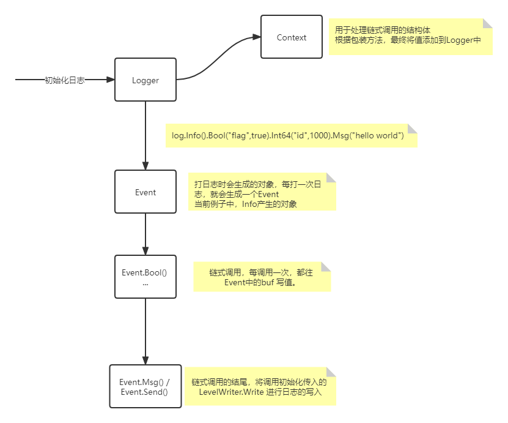

## 整体流程



### 初始化操作

```go
log := zero.log.New(os.Stdout).With().Timestamp().Logger()
```


链式调用

- `With()`将`Logger`转变为`Context`调用链，此处`Context`为一个包含`Logger`的结构体
  - `Timestamp()` 向`Hook`挂在一个方法。
  - `Logger()` 将`Context`转变为`Logger`

#### 格式化操作

时间格式化

```go
zerolog.TimeFieldFormat = zerolog.TimeFormatUnix
```


### 写日志操作

```go
log.Info().Bool("flag",true).Int64("id",1000).Msg("hello world")
```

- 通过`log.Info()`获取到一个`Event`，该`Event`从`sync.Pool`中申请。
- 当前`log`中的`context`将会在创建`Event`时，`append`到`Event.buf`中
- `Bool("flag",true)`，当前操作会将传入的`key`与`value`使用包变量`enc`进行编码，同时往`Event`中的`buf`写入
- 当调用`Msg()`或`Send()`命令时，将会把`Event.buf`写入文件。
- 当命令结束后，会调用`putEvent(e)`归还从`sync.Pool`中申请的内存


以上流程，我们只需要保证`Event`和`Event.buf`由`sync.Pool`分配内存，以及使用编码器写入时保证最少开销，即可实现一个高性能日志。

## 整体对象的描述

`Context`对象

- 用于处理链式调用。
- 每一次调用对象都不会改变原对象的值
  - Context的方法都没有增加指针，每次调用方法都会`copy`内存。

```go
type Context struct {
	l Logger
}
```

`Logger`对象

- 初始化的对象，用于产生`Event`对象

```go
type Logger struct {
	w       LevelWriter // 写策略
	level   Level // 打印的级别
	sampler Sampler // 限流器？
    context []byte // 附带信息 With().Str("Struct Name","ss")
	hooks   []Hook // 钩子函数
	stack   bool // 是否记录栈
}
```

`Event` 对象

- 将打日志操作，变为一个事件。当前事件为一次日志的完整描述。
- 当前`Event`的级别写入`buf`
- `logger`中的`Context`提前写入`buf`

```go
type Event struct {
	buf       []byte // 缓冲Buffer
	w         LevelWriter // 写入策略
	level     Level // 日志级别，Panic、Fatal、ErrorInfo、Warn、Debug
	done      func(msg string) // 完成后执行动作，给 panic 与 fatal 使用
	stack     bool   // enable error stack trace 错误日志跟踪
	ch        []Hook // hooks from context ，从logger对象获取的hook
	skipFrame int    // The number of additional frames to skip when printing the caller.
}
```


## 优化、可学习点

- 链式调用设计模式
- `Event`事件的抽象
  - 每一次打印日志，都是一个`Event`