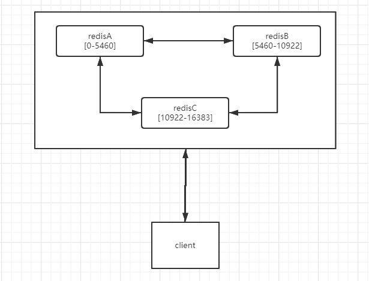
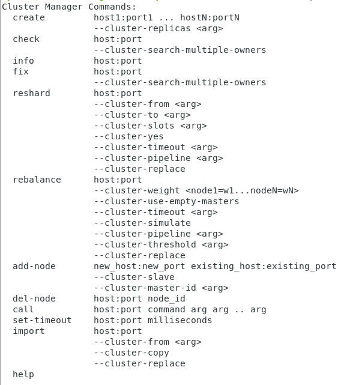

# redis

## redis的作用

### 各种value类型

#### string

可以利用 setnx 做锁。

**设置锁**

```redis
setnx lock_id 1
```

**获取锁**

```redis
get lock_id
```

**删除锁**

```redis
del lock_id
```

-----

#### hash

可以用来做购物车

**添加购物车商品**

```redis
hset cart:userID commodityID num
```

**增加购物车商品数量**

```redis
hincrby cart:userID commodityID 增长数值
```

**删除购物车商品**

```redis
hdel cart:userID commodityID
```

-----

#### list

用来做推送

-----

#### set

用来做关注列表，和点赞

#### sorted set 

用来做排行榜。阅读量排行榜等。

-----

## redis 集群如何配置

（可以直接通过各种redis 代理自动进行配置）

- twemproxy
- predixy
- cluster（redis自带）

[redis 三种集群策略](https://blog.csdn.net/q649381130/article/details/79931791)

docker需要去download redis配置文件。

```shell
wget http://download.redis.io/redis-stable/redis.conf
```

需要注释当前行

```conf
# bind 127.0.0.1
```

一般我们需要设置这个。

> 当从机与主机建立关系，是否去拉去主机原数据

```conf
appendonly yes
```

-----

### 集群原理

**当前集群模式用于增加redis的容量。**

使用集群来增加redis容量有多种方式

1. 按照功能进行划分
   - 用户模块
   - 订单模块
   - 等
2. 按照数据规律进行划分
   - [hash+取模](####hash+取模) (hashtable)
   - [random随机](####random随机)
   - [hash环](####hash环)（ketama hash）一致性hash

我们通常使用**hash环**进行**redis**集群扩展。

原因如下：

- hash 取模 ：会发生洗牌操作。当我加入一个新的节点的时候，我们需要对所有`key`进行`hash`运算，这就可能会导致我们的服务在洗牌期间无法使用。
- random 随机：由于查询随机化，我们无法准确定位数据。
- hash 环，虽然也有可能无法定位数据，但随着时间流逝，我们单个节点的数据定位将会越来越精准。并且不会影响其他节点。

-----

#### hash+取模

大公司极少使用。由于会发生洗牌操作。

原理如下：

- 对所有的`key`进行`hash`运算，并对其进行取模操作，类似于`hashtable`，将其分配到不同的`redis`服务中。

缺点：

- 当我们需要新增集群节点时，会发生洗牌操作。（也就是将节点的内容重新分配）

-----

#### random随机

原理如下：

- 每次存放一个数据时，随机存放到一个节点当中。
- 当我们需要数据时直接对所有节点进行拉取，直到获取到数据

适用于：

- kafka 之类的中间件
- topic

缺点：

- 在使用时无法精准定位
- 会增加大量的无效访问。

-----

#### hash环

较为常用。

**一般会给所有 key 附带过期时间**

原理如下：

- 将节点进行`hash`计算，获取其值
- 对`key`也进行`hash`计算，将值与各节点的`hash值`进行比对，找出`hash值`最为相邻的节点。对其进行写入或查询。

各种问题解决方案：

1. 节点堆积在一片区域，压力分摊不均
   - 可以使用虚拟节点减少压力分摊不均的问题。
2. 新节点插入之前存放数据，可能导致数据无法访问。
   - 首先`hash`环，一般不用于当作数据库，因为会发生数据丢失的情况。
   - 可以往相邻的节点进行访问遍历，判断是否存在。（需要控制访问次数，因为这条数据可能不存在于缓存当中）

优点：

- 不会发生洗牌操作

缺点：

- 可能会出现节点堆积在一片区域
- 在新节点插入之前存入数据，可能会导致数据无法访问。

-----

### 主从模式

**当前集群模式用来降低单台服务器的读压力**

#### 从机配置：(需要)

设置 master 机的ip 端口

```conf
slaveof 主机ip 主机端口
```

由于 `slave` 具有侮辱性，新版本改名为 `replica`

```conf
replicaof 主机ip 主机端口
```

设置 master 密码

```conf
masterauth 密码
```

进入从机 redis 测试

```redis
info replication
```

**查看`master_link_status`是否为`up`**

-----

### 哨兵模式

**当前集群模式用于提高我们程序的高可用**

当主服务器崩溃，会选取新的`leader`服务器。我们通过请求 sentinel monitor 应用来获取我们当前的主节点。

通过 redis 自带服务 sentinel 启动即可，当主服务器崩溃时，自动将从服务器替换成主服务器，以此来保证高可用。

**（ 一般为奇数台 ）**

原因：

- 奇数台redis 与 偶数台redis 可允许崩溃的redis数量是一样的。
- 会引发更多的投票，由于约定必须要50%以上的人

#### 启动方式：

```shell
redis-server ./configFile --sentinel
```

需要创建一个配置文件。

```conf
port `sentinel的端口号`
sentinel monitor `名字` `主机ip` `主机端口` `需要多少个sentinel来确定主机是否死亡`
```

剩下的事情 sentinel 将会自动完成。

-----

### cluster

底层原理是 **hash+取模** ，他的底层进行一个预分区操作，将数据直接划分到16384个槽位，给集群中的每台redis分配一定的槽位，呈现如下形式



假如，我们存放一个**key**，它`hash(key)%16384=3345`，那它将跳转到**redisA** 并将当前**key**存入。当我们要对他进行操作时，也会自动跳转到**redisA**。

#### 注意：

- 由于底层写死了，redis 最多分出 16384 

#### 集群配置：

如果我们要开启 cluster 集群，我们需要在配置中修改如下几行

```conf
cluster-enabled yes
cluster-config-file nodes.conf
cluster-node-timeout 5000
appendonly yes
```


#### 启动方式：

```shell
redis-cli --cluster create ip:port ip:port ip:port --cluster-replicas num
```



##### 主要使用解析

- create 创建。
  - `host:port` redis服务的ip和端口
  - `--cluster-replicas` 单个节点配置几个从机
- check 检查节点
- info 单个节点信息
- fix 修复集群和槽的重复分配问题
- reshard 更换分区
  - `--cluster-from` 从哪获取分区 （redis服务的ip和端口）
  - `--cluster-to` 分区到哪里（redis服务的ip和端口）
  - `--cluster-slots` 槽位分配
- rebalance 指定集群的任意一节点进行平衡集群节点slot数量 
- add-node 添加新的节点
- del-node 删除节点

-----

## redis各种问题

### 击穿

**出现场景：**

- 当key过期了，或不存在时，所有请求直接导向db

**解决方案：**

- 当发现缓存中不存在这个key，我们可以在redis中建立一个锁，然后去访问db。其他请求做同样操作。如果发现已经存在锁了，则在外轮询等待。

-----

### 穿透

**出现场景：**

- 查询空数据。

**解决方式：**

- 将空数据同样缓存到redis中。
- 使用布隆过滤器

-----

### 雪崩

**出现场景：**

- 当大量key同时过期
- 当需要在0点对缓存进行大量更新

**解决方式：**

1. 对于大量key同时过期：
   - 随机过期时间 -- 让更新时间均匀化
2. 对于需要在0点对缓存进行大量更新
   - 依赖击穿方案

**案例：**

Q2:

- 我们需要在0点对小说的日排行榜进行更新，我们需要重新计算各排行榜的数值。

A：

- 我们对需要更新的数据进行加锁，阻止请求访问我们的数据库。
- 我们更新的线程去对排行榜进行新的计算操作。比如综合排行，日排行，等。

-----

### 分布式锁

我们使用**redis**实现分布式锁时，它会带来几个问题：

| Question                                                     | Answer                                                       |
| ------------------------------------------------------------ | ------------------------------------------------------------ |
| 我如何保证不重复上锁？                                       | `setnx` 当`key`不存在时才能设置成功。                        |
| 当我上锁之后我的执行程序崩溃了。如何解决？                   | `expire` 使用过期时间解决                                    |
| 当我过期时间到达了，但我的程序并没有完成相应操作，如何解决？ | 通过程序的守护线程，不断给锁续命                             |
| 如果我的锁没续上命，那我如何确保不删错锁。（极小可能出现此问题） | 在上锁之前获取一个随机值， `setnx key randomNum`，在删锁之前判断一次 |

**一般我们使用zookeeper做分布式锁，或者一些cp理论模型的中间件**

