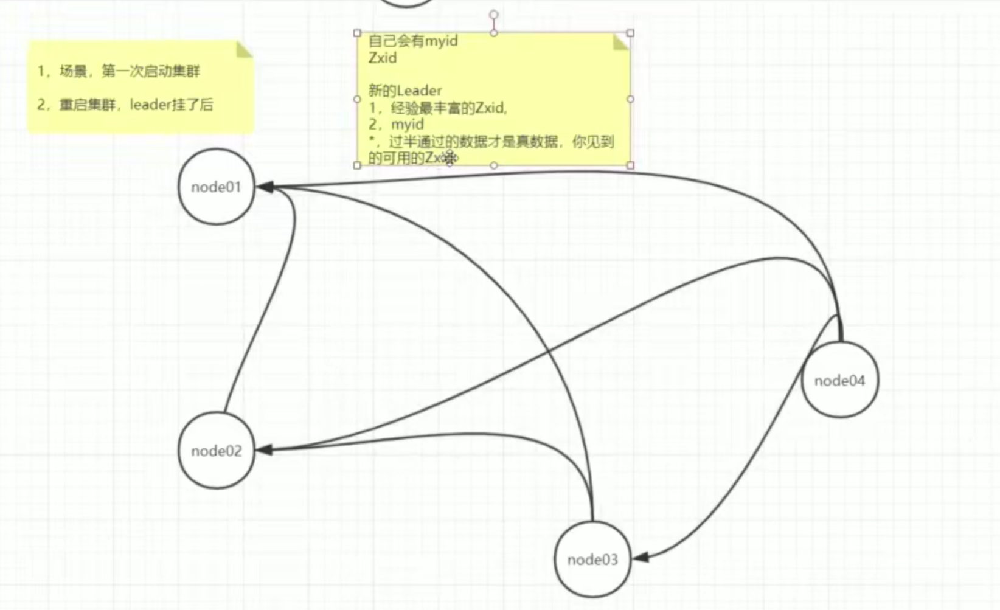
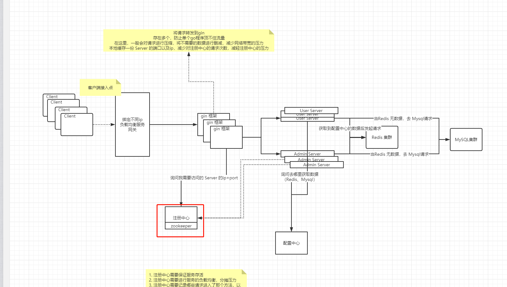
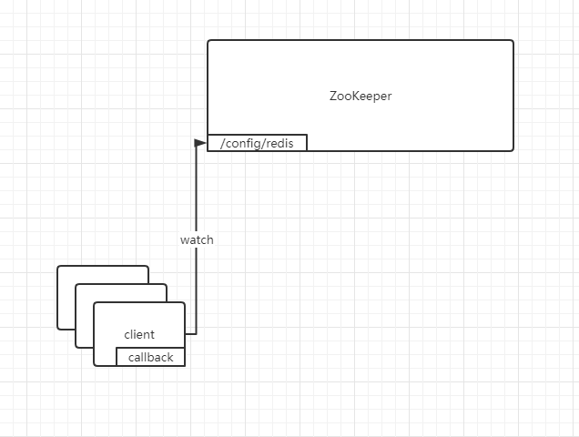
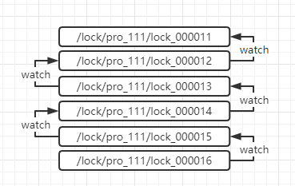

# ZooKeeper

-----

## ZooKeeper 简介

#### zookeeper 设计目标

- 简易使用
  - 存储数据结构类似于文件系统，并且ZooKeeper的数据只保留在内存中
- 主从复制
  - 为了确保高可用，ZooKeeper本身支持**主从**配置。并且在**主机**死亡时自动并且快速的选举出新的**主机**
- 操作串行化
  - 所有写操作都会附带一个序列号，可以让我们快速的与从机同步数据
- 以读为主
  - 由于所有写操作都在主机完成，并不会提升写入速度，所以zookeeper 集群的主要作用是减少读操作。

#### zookeeper 的数据模型和分层名称

是一个目录树的存储空间，所有数据都存储在每个节点上

-----

## ZooKeeper 集群

#### 角色

在ZooKeeper 集群中，有三个角色

- Leader 能执行读写操作
- Follower 能执行读操作，会将写操作转发到Leader上，并且可以参与选举投票
- Observer 只执行读操作

#### Paxos

Paxos 其实就是一个分布式一致性算法的思路，由于它是以故事的形式来讲述这个算法，没有实际的数学支撑，所以直到近几年才被利用上。

> 引用文章 [Zookeeper全解析——Paxos作为灵魂](https://www.douban.com/note/208430424/)

定义

- 议员总数是固定的
- 每次事务变更都需要通过一个提议（Proposal），不能倒退
- 每个提议都需要超过半数的议员同意才能生效。
- 每个议员会将成功提交的提议记录在笔记本上

运作

- 有一个议员发布了提议： 将电费设置为1元/度
- 当前议员查看记事本，查看当前的`提议id`，并给当前提议设置id，`当前提议id+1`
- 将`提议id`发送给其他议员
- 其他议员查看记事本，判断当前`提议id`是否大于记事本上的`提议id`。
  - 大于，记录下当前提议，并回复
  - 小于，不接受提议，并且告诉对方你的提议已经有人提过
- 当回复接受的提议超过半数时，发布提议的议员将会通知全部议员，让他们更新，并颁布正式法令

#### 选主

ZooKeeper 中的选举方式如下

- 假设有 ABCD 四台机子，当时 D 为主机。
- D机 崩溃了
- **C机**先发现了**D机**崩溃，向**A机**和**B机**发送请求，告诉主机崩溃了，我们需要进行选举，并附带了自己的信息（序列，nodeID）
- 当**A机**和**B机**收到请求后，回去判断主机是否真的崩溃了，如果崩溃了，他们会拿**C机**的信息进行对比
  1. 判断序列是否 <= 自己的序列
  2. 判断 NodeID  < 自己投的机子的 ID
- 如果符合以上两个要求，则将会把票投给**C机**，如果**1.**不符合，则将会把自己的序列号返回给**C机**并告诉他你的数据不是最新的。
- 当有一台机子获得到了 `(机子总数/2)+1`的票数时，他将会变成主机

-----

## ZooKeeper 使用场景

- 服务注册中心

  - 由于 ZooKeeper 客户端的Session特性，使我们不需要对服务是否存活进行检测。它在内部进行了实现。

  

- 分布式配置中心

  - 由于 ZooKeeper 的 watch 关键字，使分布式配置实现变得轻松。每个Service 只需要监听特定路径，并传入回调函数，当路径下的内容发生改变，它将会自动调用回调函数实现配置的变更。

  

- 分布式锁

  - 由于 ZooKeeper 的 watch 关键字，我们能非常轻松的实现分布式锁功能。
    1. 我们在需要创建一个带序列的临时节点
    2. 判断当前序列是否是最小的
       - 如果是，则执行锁操作
       - 如果不是，则监听上一个序列号的节点。
    3. 当执行完操作后，释放当前节点
    4. 如果有服务监听当前节点，当他发现当前节点 deleted 之后，将会执行锁操作

  