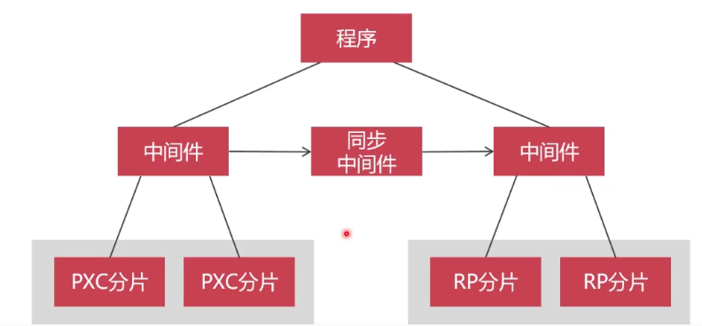
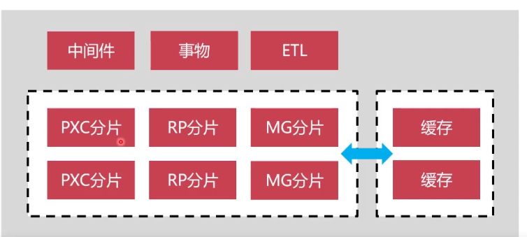

# MySQL 数据架构

## 数据架构

1. MySQL + 分布式Proxy扩展
2. 数据归档，冷热数据分离
3. MySQL+缓存（Redis）高并发架构
4. MySQL+小文件系统
5. MySQL+Inforbright统计分析架构

### MySQL + 分布式Proxy扩展

####  PXC

- 强一致性
- 数据库变慢（因强一致性导致）

可通过**数据切分**提升性能 (MyCat)

#### Replication

- 弱一致性
- 读写分离，压力减轻

#### PXC + Replication

将数据水平切分

- 强一致性的数据利用PXC存放
- 弱一致性利用Replication

利用中间件进行数据之间的同步。

或通过 ETL，将数据抽取出来，然后做表连接查询。 Kettle中间件

#### MongoDB + PXC + Replication

出现问题：

- 如何将PXC+RP+MG 联合起来做事务

解决方式：

- GTS中间件
- 消息中间件

-----

### 数据归档

 

冷热数据分离

分为两种方式

- MongoDB 做归档数据库
- TokuDB 做归档数据库

#### MongoDB 

优点

- 兼顾读写性能

缺点

- 没有事务，无法保证事务的ACID

#### TokuDB

优点

- 是MySQL的存储引擎
- 高速写入数据，是innoDB的9倍
- 压缩比是innoDB的14倍
- 写入性能是MongoDB的4倍 （带事务写入）

### MySQL+缓存（Redis）高并发架构

- Redis
- Memcached

### MySQL+小文件系统

有几种方式 

- MySQL + Nginx
- MySQL + Mongo - GridFS
- MongoDB RP+Sharding
- hdfs文件系统

### MySQL+Inforbright

每日数据分析 采用这种模型

- Inforbright
- mpp