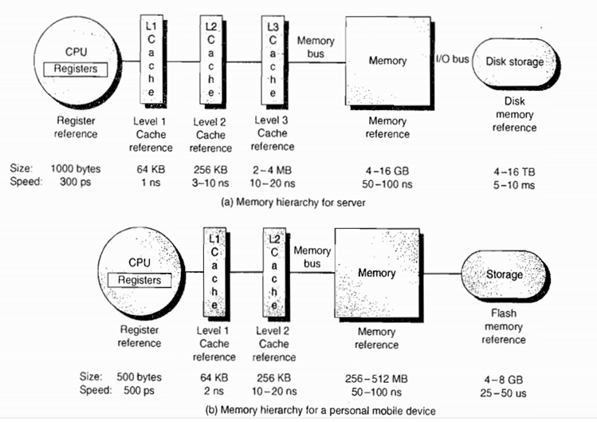

# CPU&系统&IO

主要用于梳理所学。


#### 掌握知识：

CPU  访问内存的速度并不快。取家里的配置大致如下

- L1 cache  1 ns
- L2 cache 4 ns
- L3 cache 11 ns
- Memory 70 ns




我们运行一个程序，需要从硬盘中读取到内存，再由CPU 从内存中读取到 L3 L2 L1 缓存 再读到regsiter中

- Disk -> Memory -> L3 -> L2 -> L1 -> Register


## 系统

### 用户态、内核态

linux 为了一定的安全性，将对于硬件的操作，交由了内核进行处理。将应用的普通操作，直接交由内核处理。

可以这么理解，某些特定的方法

- 调用显卡展示。
- 读取写入硬盘。
- 读取写入网卡。

以上这些内容，需要经过内核，才能进行调用。


用户态执行的内容

- 简单的计算。是直接可以在用户态执行的。


当用户态切换到内核态时，是需要经历**中断**的


### CPU线程、进程、协程（纤程）

在linux 中

- 进程，为最小分配单位，分配的内容是内存
- 线程，为最小执行单位，是用于让CPU进行执行的
- 纤程，是在线程之上的，是在用户态上的线程，在切换时不需要调用内核方法。

**线程**

- 线程多了，系统调度压力会大。
- 线程较为重量级，它是直接交由内核进行调度的。
- 线程需要 1 MB 内存。

**纤程**

- 在用户态进行调度、切换。
- 纤程是运行在线程之上的，只需要保留一定的值。所以非常的轻便
  - golang 的协程 goroutine 就是很明显的例子，在留有一定的变量申请的情况下总大小 2 KB。
  - 并且由于是用户态完成调度，系统内核的调度压力并不大。


### 内存分配

在 Linux 系统中，内存分配如下，他会将完整的一篇内存，切分成一块儿一块儿的。


当应用程序需要内存时，就会一次性给他分配4KB，让他在这4KB 里面进行操作。

同时，为了防止内存被随意篡改，以及，为了保证程序的透明性，引入了一个概念，虚拟内存映射。

- 每个应用程序都认为整套内存都是属于他的，它可以任意申请内存地址。
- 当应用程序需要内存时，系统会分配给他 4KB，让他自己去申请调用变量。
- 各个应用程序对互相的内存是不可见的。


系统是使用了一篇内存，作为映射表，将程序申请的内存关联起来，使得其内部所使用的内存是关联的


##### 猜测：

系统中会有一个内存映射地址表。

表中如下结构。

1. 可以通过Bitmap 判断某块内存是否被分配。

2. 可以通过链表，将分配给程序的内存连接起来

3. 可以通过hash表，快速的将虚拟内存中的地址映射出来。

有以上三个内容，我们就可以做到在程序中内存的连续性以及透明性。


### 中断

> [面试官：什么是软中断？](https://zhuanlan.zhihu.com/p/338075214)

中断分为软中断和硬中断，

对于软中断硬中断的概念我也不清楚。

- 硬中断，鼠标键盘的中断，直接发信号给CPU。让CPU停止运行当前执行的内容
- 软中断，应用的中断，调用 0x80h 。让CPU停止运行当前执行的内容

**中断的主要意思如下**：

- 暂停当前执行内容，将当前执行内容以及结果保存（保存回L1 L2 L3 内存，具体根据CPU缓存一致性协议。）（也就是，保护现场）。
- 终止当前执行后，开始执行新的内容，新的内容为打断该操作的内容（好像是写道寄存器中的指令）。


**在什么时候会用到**

- 在用户态调用内核态的时候，会需要软中断去执行、调用该程序内容
- 网络编程中的 accept。以及 read。这些都会出现用户态切换内核态的情况。


**带来的问题**

- 在理想情况下
  - 软中断后程序继续读取源程序进行执行，没有去访问内存。在这种时候，源程序的汇编码在L1 缓存下。cpu可快速读取该数据进行二次执行。
- 不理想情况下
  - 当前程序被其他核心拿去执行了。那该程序需要从 L3 or Memory 中重新读取执行指令，根据 cpu缓存图表，cpu读取内存数据在50-100ns 左右。
  - 如果我们对其进行多次的系统调用，就会导致程序较慢。


### IO

IO 是指 input 和 output。


#### 虚拟文件系统

linux 中有一个概念，是叫做虚拟文件系统。

在我们linux中，万物皆文件。什么事情都可以使用文件来代表。一个内核参数、一个socket连接、一个文件。


Linux 底层，有一个叫做 page cache 的概念，这个东西就是在内存中用于缓存硬盘中数据的东西。它也是一片内存，并不是一个独立的区域。

在读取文件时，会先去访问 page cache ，判断我要读取的文件是否存在于内存中，如果存在，则直接通过内存返回展示。

如果不存在，CPU 则会去硬盘（通过fd）中查找，然后调用 DMA 去获取硬盘的一块指定区域，将其丢入 内存的一块区域，那一块区域，就是page cache 。并且，在读取写入的同时，他会遵循page cache 的大小(默认4KB)，每次读取4KB。


可以在linux内核设定一些参数值。

- 再多大量进行改写时同步到硬盘
- 多久将改写内容同步到硬盘

上面这些值，就可以优化对于硬盘的写入次数。比如如下场景：

在每个小时的某5分钟内，会对某个文件(文件100 KB)进行大量的重复写入，重复修改。在这个时候，上面的两个参数设置为 同步数据到硬盘为6分钟一次，当硬盘修改量大于120 KB 时才写入硬盘。（习惯留有一定冗余）

- 缺点：
  - 上面这样调优有一定的风险，如果在没有触发阈值的情况下，关机重启，那该数据将会丢失！
- 优点
  - 由于不是直接同步到硬盘，所有操作都是在内存完成。速度会非常非常快。
  - 并且写入不会非常平凡，在某些情况下，只需要对硬盘进行两次同步，即可完成写入


##### 文件描述符

在Linux 中，我们的所有文件都具备 "文件描述符(file description)" `fd` 

我们可以通过文件描述符，去找到相应的文件、连接、参数。

文件描述符是由内核统一管理。

#### 本地IO

参考虚拟文件系统。

本地IO会通过DMA读取数据到 Page Cache 中，并且根据内核设定值，进行定期的更新操作。

#### 网络IO


**网络IO 分为三个步骤**

1. 监听某某端口 （内核调用）
2. 接收文件描述符 （内核调用）
3. 读取socket 连接（内核调用）

##### BIO

Blocking IO， 阻塞型 IO。有多少个连接。他就需要开多少个线程去等待接收。


**调用方法原理如下**：

- 开启线程，
- 阻塞读取socket （一次系统调用）
- 当socket好了，接着往下执行


根据我们上面的 `CPU线程、进程、协程（纤程）` 知识，我们知道线程资源是比较宝贵的，同时也是比较重量的。

在这种情况下，我们来多少连接，就建立多少个线程是不明智的，是浪费的。（主要原因还是线程太大，而且网络IO主要是等待独写。并不消耗 CPU，单独占一个线程就会导致内核调度压力大，同时还占内存。）


在BIO 的环境下，不会重复调用触发内核方法。


##### NIO

Non Blocking IO 不阻塞型IO，当你去拿文件描述符去内核读取信息时，会出现两个分支。

- 如果存在数据、或链接，他会给你返回连接
- 如果不存在数据、或链接，他会给你返回 -1

NIO 就已经非常好的解决了上面的问题，我们只需要开一个线程，就能很好的处理http请求。

**调用方法原理如下**：

- 监听是否拥有连接进来 （可以使用阻塞，也可以使用不阻塞，不阻塞会导致一直调用系统方法）

  ```go
  // 伪代码，非阻塞版
  for {
      fd := io.accept()
      if fd != nil {
          // 写入某个数组中，让以后可以读取数据
      } 
      
  }
  ```

- 开始一直遍历进来的连接是否有数据 （这里的read会调用内核方法）

  ```go
  // 伪代码
  for i,v := range fd{
      if v.read != nil {
          // 执行操作
      }
  }
  ```

我们以前，是通过同步阻塞，等待他连接传输完毕，我们再做相应的处理。

但是现在这种情况改变了，我们不知道他什么时候会传输完毕，我们只能通过死循环，一直对其进行访问。 1. 是否来的新的连接。 2. 是否可以读取文件。我们需要一直对其进行访问，一直调用内核方法。我们才能知道他是否返回了数据。

在调用的过程中，由于是访问 网络IO，触碰了内核方法，就会导致一直执行**软中断**。执行中断的后果就是开销过大，可能会重复导致CPU重新从内存获取执行命令。导致该线程的执行较慢（CPU最小调度单位）


在NIO 的环境下，会一直调用触发NIO，这就会产生大量的浪费。CPU都在读取指令，以及中断转换上了。

##### SELECT

为了解决NIO 的问题，新增的一个叫做多路复用器的东西。

由于我们上面所说，NIO 会导致系统一直调用**中断**，导致系统一直在用户态和内核态的切换上。

那为了解决这个问题，就诞生了SELECT


Select 同样要去执行网络IO的第一步以及第二部操作，这里我们可以直接使用同步阻塞，让他等待接收文件描述符，然后将读取socket连接数据交由select执行。

调用方法原理如下：

- 传入一个fd数组，可设置等待过期时间。 （触发一次系统调用）
- 内核会去遍历fd数组，去判断这些数据是否已经传输完毕，传输完毕的会汇总下来。
- 将汇总结果返回给应用。
- 应用可以拿着这些数据去read。（系统调用）。
- 由于里面有数据，不会阻塞，所以这个模式很快，也不会产生额外的系统调用。

但是由于最初的 select 支支持一个 fd 1024个byte。不支持更多的，所以就衍生出了poll


##### POLL

poll 和 select 原理一致。只不过没有大小的限制

##### EPOLL

观察 select 模式，我们照样能发现一个新的缺点。 ---- 我们还需要将所有 fd 传入进去，让内核去遍历。

但实际上，我们的CPU是能知道哪些数据是否已经ready的。

在这种情况下， epoll 就维护了一片内存区域（内核和用户空间共享一块内存来实现的），那边内存区域用红黑树进行关联，内部节点为 fd 文件描述符。

**epoll可以理解为event poll**，不同于忙轮询和无差别轮询，epoll会把哪个流发生了怎样的I/O事件通知我们。所以我们说epoll实际上是**事件驱动（每个事件关联上fd）**的，此时我们对这些流的操作都是有意义的。**（复杂度降低到了O(1)）**。

通知操作（事件驱动）一般就是将fd从红黑树，移动到链表中。

用户态的程序只需要监听该链表，即可完成。

当前方法降低了 poll/select 的轮询次数

**内存展示**


操作解析

