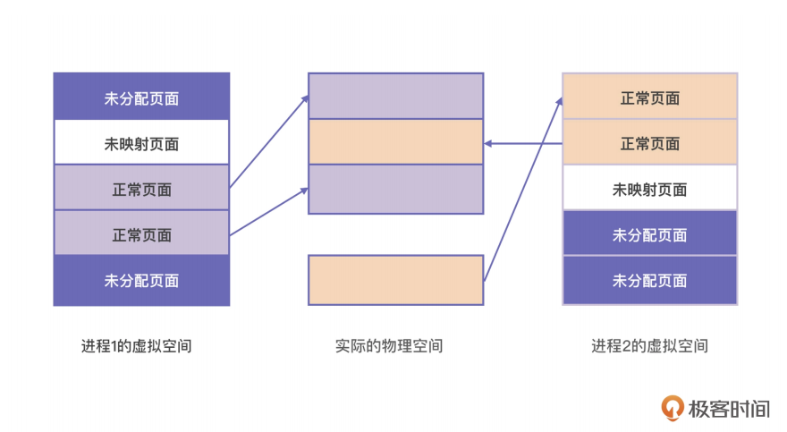
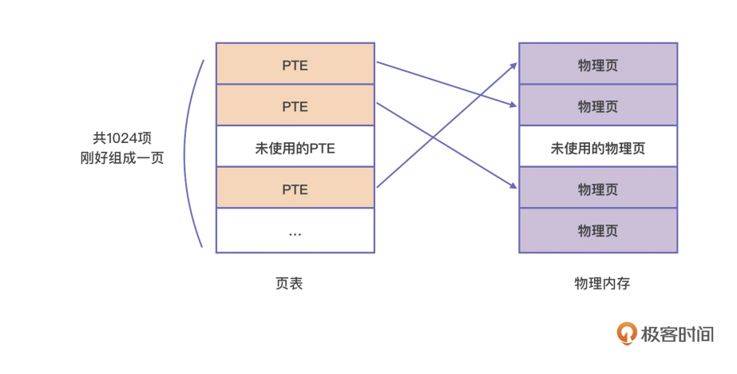

当前笔记为学习 海纳老师 的课程。

> https://time.geekbang.org/column/intro/100094901

### 程序局部性原理

无论一个进程占用的内存资源有多大，在任一时刻，它需要的物理内存都是很少的。

### 虚拟内存

虚拟内存是什么？虚拟内存就是 CPU 充分利用程序局部性原理，提出了虚拟内存和物理内存的映射 (Mapping) 机制。

这种映射关系是以页为单位的。多个进程的虚拟内存中的页都被映射到物理内存页上。

从图中我们可以看到。第一，虽然虚拟内存提供了很大的空间，但实际上进程启动之后，这些控件并不是全部都能使用的。开发者必须要使用 malloc 等分配内存的接口才能将内存从待分配状态变成已分配状态。

在你得到一块虚拟内存以后，这块内存就是未映射状态，因为它并没有被映射到相应的物

理内存，直到对该块内存进行读写时，操作系统才会真正地为它分配物理内存。然后这个页面才能成为正常页面。

第二，在虚拟内存中连续的页面，在物理内存中不必是连续的。只要维护好从虚拟内存页到物理内存页的映射关系，你就能正确地使用内存了。这种映射关系是操作系统通过页表来自动维护的，不必你操心。

不过你还要注意一点，计算机的虚拟内存大小是不一样的。虚拟地址空间往往与机器字宽

有关系。例如 32 位机器上，指向内存的指针是 32 位的，所以它的虚拟地址空间是 2 的32 次方，也就是 4G。在 64 位机器上，指向内存的指针就是 64 位的，但在 64 位系统里只使用了低 48 位，所以它的虚拟地址空间是 2 的 48 次方，也就是 256T。

#### 页表的结构

映射的过程，是由 CPU 的内存管理单元 (Memory Management Unit,MMU) 自动完成的，但它依赖操作系统设置的页表。

页表的本质是页表项 (Page Table Entry, PTE) 的数组，虚拟空间中的每一个页在页表中都有一个 PTE 与之对应，PTE 中会记录这个虚拟内存页所对应的实际物理页的起始地址。为方便理解，我这举了个例子，下面这张图描述的是 i7 处理器中的页面映射机制。

