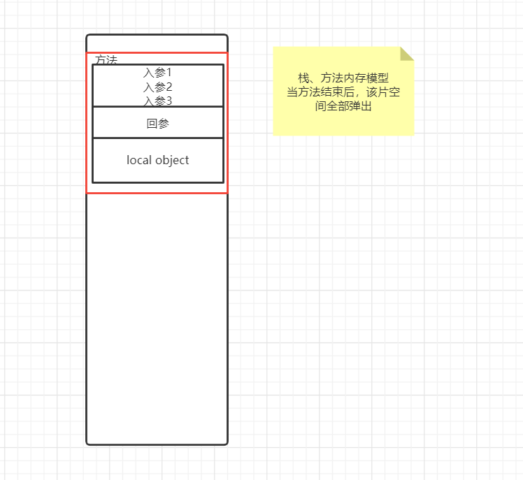
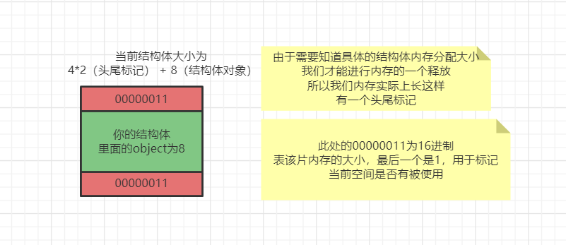

### 栈

栈是存在于某作用于的一块内存空间

```golang
{
    ...
}
```

当你调用函数，函数本身即会形成一个 stack 用来存放它所接收的参数，以及返回的地址，同时还会有一个 Local Object




### 堆

也是一片内存空间，只不过该片内存空间交给用户自由管理、分配。

- c++ 就是靠 `new` 和 `delete`
- c 就是靠 `malloc` 和 `free`
- Golang 就是靠 本身内存模型 + `gc`

### 具体的内存模型如下

- 无论在堆上还是在栈上，实际上堆与栈就是相同的内存空间
- 只不过管理方式不同
  - 栈是用完系统自动退出
  - 堆是依靠用户动态分配，自行管理
- 但实际上的存储还是相同的


#### 基础类型



在c++ 中 VC 编译器中，内存模型如下，猜想 Golang 也几乎一致

每个结构体对象都有标记相应的对象大小。

- 头尾标记，用于记录该结构体大小，以及内存是否被使用。
  - 头标记，标记结构体大小，同时标记是否被占用，总大小4 byte
  - 尾标记，标记结构体大小，同时标记是否被占用，总大小4 byte
- 具体结构体对象：8 byte

表现：

```golang
type A struct{
    num1 int32
    num2 int32
}
```

#### 有填充类型

- 填充，就是当你结构体不符合16 byte的倍数时，自动补齐到16倍数的一个操作。


#### 数组类型

- 与普通结构体相比，增加了一个数组长度

