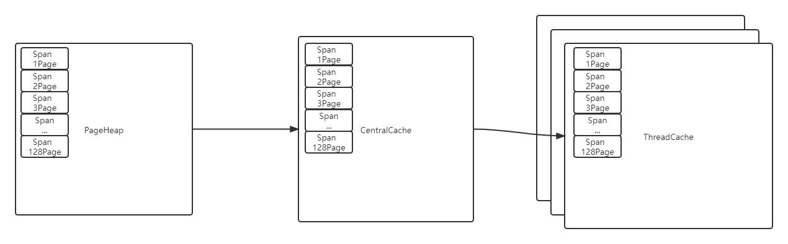

# golang 内存管理

> https://juejin.cn/post/6844903881801990151#heading-6

Go的内存管理借鉴了TCMalloc的设计思想与原理，所以我们先得稍微了解一下TCMalloc。

### TCMalloc

> https://wallenwang.com/2018/11/tcmalloc/

TCMalloc是Thread Cache Malloc的简称。它是操作系统层对内存管理模型之一。

#### 基本概念

- Page
  - 操作系统对内存管理以页为单位，在x64下Page的大小为8KB
- Span
  - 一组连续的Page被称为Span，Span比Page高一个层级，是为了方便管理一定大小的内存区域。
  - 在TCMalloc中，Span是内存管理的基本单位
- ThreadCache
  - 每个线程各自的Cache，一个Cache包含多个空闲内存块链表，每个链表连接的都是内存块，同一个链表上内存块的大小是相同的，也可以说按内存块大小，给内存快分了个类，这样可以根据申请内存的大小，快速从合适的链表选择空闲的内存块。
  - 由于这是每个线程各自的Cache，所以 ThreadCache访问是无锁的。
- CentralCache
  - 所有线程共享的缓存，也是保存的空闲内存块链表，链表的数量与ThreadCache中链表数量相同，当ThreadCache内存块不足时，可以从CentralCache取，当ThreadCache内存块多时，可以放回CentralCache。
  - 由于CentralCache是共享的，所以它的访问是要加锁的。
- PageHeap
  - PageHeap是堆内存的抽象，PageHeap存的也是若干链表，链表保存的是Span，当CentralCache没有内存时，会从PageHeap取，把1个Span拆成若干内存块，添加到对应大小的链表中，当CentralCache内存多时，会放回PageHeap
  - PageHeap是在CentralCache上层，会被多个线程同时访问，所以也是加锁的。

#### 关系图

- PageHeap直接与系统进行交互，CentralCache与Pageheap进行交互，ThreadCache与CentralCache进行交互。
- 大于128Page（1个Page 8KB，这里也就是1MB），将会直接从PageHeap进行分配。

这里用到了多级缓存的概念，每个线程都留有一定缓存，尽量避免访问全局，导致加锁。

#### Span示意图

- Span 1Page表示，该Span中拥有1个Page。Span 128Page表示，该Span中拥有128个Page。

#### 整体总览图

### Golang的内存模型

#### 基本概念

- Page
  - 与TCMalloc相同，是Golang内存的页单位。x64下1个Page的大小是8KB
- Span
  - 与TCMalloc相同，Span是内存管理的基本单位，他的下层是Page。
  - 代码描述中为`mspan`
- mcache
  - 与TCMalloc的ThreadCache类似，mcache保存的是各种大小的Span，并按Span class分类，小对象直接从mcache分配内存，起到了缓存的作用，可以无锁访问。
  - mcache 在golang中是与P进行绑定（GMP理论）
- mcentral
  - 与TCMalloc的CentralCache类似。 所有线程（P）共享访问的缓存，需要加锁访问。它对Span class的Span进行分类，串联成链表，当mcache的某个级别的Span的内存被分配光时，他会像mcentral申请1个当前级别的Span。
  - 但mcentral与CentralCache也有不同点，CentralCache是每个级别的Span有1个链表，mcache是每个级别的Span有2个链表，这和mcache申请内存有关，稍后我们再解释。
- mheap
  - mheap与TCMalloc中的PageHeap类似，它是堆内存的抽象，把从OS申请出的内存页面组织成Span，并保存起来。当mcache的Span不够用时，会向mheap申请，当mheap的Span不够用时会向OS申请。
  - 向OS的内存申请是按页来的，然后把申请来的内存页生成Span组织起来，同样也是需要加锁访问的。
  - 但mheap与PageHeap也有不同点：mheap把Span组织成了树结构，而不是链表，并且还是2棵树，然后把Span分配到heapArena进行管理，它包含地址映射和span是否包含指针等位图，这样做的主要原因是为了更高效的利用内存：分配、回收和再利用。

#### 关系图

如同TCMalloc的概念一样，mheap -> mcentral -> mcache 。

### 虚拟内存概念

虚拟存储器：或称之为虚拟内存，在程序分配内存时，通常都是通过`mmap`做虚拟内存映射。当你在程序中申请一篇内存时，他不会立刻提供物理内存，而会等你真正使用它时进行申请。

- 操作系统大多采取机会主义分配策略，申请内存时，仅承诺但不立即分配物理内存。
- 物理内存分配在写操作导致缺页异常调度时发生，而且是按页提供的。

