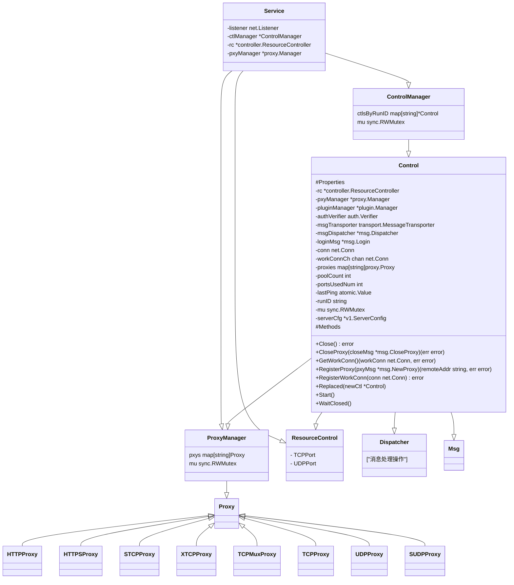
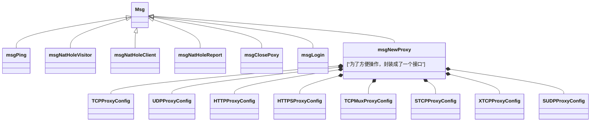

# frp

深圳电信，在2024年3月初，突然发现深圳电信不提供公网IPv4了（如有需要，可以每月100的费用额外购买），价格过高，不进行考虑。根据相关了解，其也不提供IPv6。但有时又需要访问家里的设备（obsidian、mysql测试库）。

基于以上原因，打算了解内网穿透相关概念。

市面上有多种内网穿透软件，frp、n2n、zerotier、headscale（开源）+tailscale。

其中

- n2n 反馈是 500M宽带，能跑到300M（P2P），评判较为优秀
- zerotier，500M带宽，可能才100M（P2P）

frp 实现的协议列表 [文档](https://gofrp.org/zh-cn/docs)

| 连接方式 | 简介                                                         |
| -------- | ------------------------------------------------------------ |
| tcp      |                                                              |
| udp      |                                                              |
| http     |                                                              |
| https    |                                                              |
| stcp     | 加密版的TCP                                                  |
| sudp     | 加密版的UDP                                                  |
| xtcp     | P2P打洞，支持退回到其他连接方式，有保底操作，但打洞成功后为了稳定性并不会切回 |
| tcpMux   | tcp的端口复用实现                                            |


其中 frp 是公司当前主用软件，同时又是go语言，打算基于此开始学习相关内网穿透

[源码](https://github.com/fatedier/frp/tree/acf33db4e4b6c9cf9182d93280299010637b6324)，基于acf33db4e4b6c9cf9182d93280299010637b6324 commit版本


## 简介

frp是一款代理工具，它可以无视复杂的网络环境做代理，只需要客户端与服务器能相互连接，即可通过连接服务器来实现代理模式。

他是基于端口形的代理，与上述的内网穿透还是有一定的差别。上述几个内网穿透软件，都是通过创建虚拟网卡实现的互联。


## 源码解析

因为我们主要是为了学习内网穿透（NAT穿透、NAT打洞、P2P），所以主要内容还是看他的xtcp。打算以tcp为基础学习目标，了解具体流程后即停，不深究。

其主要初始化手段是go的[`package init()`](https://go.dev/doc/effective_go#init)，此方式个人不是很建议。看起代码来其实还是比较复杂的。

### 使用库

主要涉及库

| 库名                                                    | 功能                                                         |
| ------------------------------------------------------- | ------------------------------------------------------------ |
| [cobra](https://github.com/spf13/cobra)                 | 一个强大的cli 命令行提示工具，简单理解为类似flag包即可，不过其提示功能做的更加完善与强大 |
| [websockect](https://github.com/gorilla/websocket)      | gorilla 的 websocket包，但已经不更新了                       |
| [fatedier/golib/mux](https://github.com/fatedier/golib) | 作者自有库，用于复用网络连接，根据数据的前几个字节将网络分发给不同的监听器。 |
| [fatedier/golib/msg](https://github.com/fatedier/golib) | 作者自有库，传递消息的控制实现                               |
| [fatedier/golib/io](https://github.com/fatedier/golib)  | 消息传递、代理、加密、压缩实现。                             |

#### cobra

类似官方提供的flag包，Execute可以看作为 flag.Parse()。

个人感觉只要定义清晰非常好用。

相较于官方的flag包，他提供了自动补全，自动生成手册页（`man`），以及在用户输入错误的情况下，自动提供了演示

- Easy subcommand-based CLIs: `app server`, `app fetch`, etc.
- Fully POSIX-compliant flags (including short & long versions)
- Nested subcommands
- Global, local and cascading flags
- Intelligent suggestions (`app srver`... did you mean `app server`?)
- Automatic help generation for commands and flags
- Grouping help for subcommands
- Automatic help flag recognition of `-h`, `--help`, etc.
- Automatically generated shell autocomplete for your application (bash, zsh, fish, powershell)
- Automatically generated man pages for your application
- Command aliases so you can change things without breaking them
- The flexibility to define your own help, usage, etc.
- Optional seamless integration with [viper](https://github.com/spf13/viper) for 12-factor apps


#### mux

当前这个库其实是一个工具包，可能是作者使用偏好罢了，其完整路径如下：github.com/fatedier/golib/net/mux

其作用是：定义了一个复用网络连接的包。它可以监听网络连接，根据数据的前几个字节将网络连接分发给不同的监听器。这样就可以在同一个端口上服务多种协议。例如，你可以在同一个端口上同时监听 HTTP 和 HTTPS 连接。

主要的代码逻辑由以下几个部分组成：

- `NewMux`：初始化一个新的 `Mux` 结构体实例，它将在一个给定的网络监听器上进行操作。
- `Listen`：这是一个扩展功能，用于依据指定的优先级，需要的字节数以及匹配函数在复用的网络监听器上建立监听。在函数内部，新的监听器会被按优先级和需要的字节数排序并加入监听器列表。同时需要提供**匹配函数**。
- `ListenHttp`和`ListenHttps`：这两个函数是用于创建 HTTP 和 HTTPS 的监听器。
- `DefaultListener`：如果没有默认的监听器存在，就创建一个新的监听器，并作为默认监听器返回。
- `Serve`：这个函数开始接受连接，并为每个连接启动一个新的 Go 协程来处理。
- `handleConn`：这个函数逐个检查获得的网络连接，通过调用注册的**匹配函数**来确定是否应该处理该连接。一旦找到匹配项，连接就会被发送给匹配的监听器。如果没有找到匹配项则关闭连接。
- `listener`的`Accept`和`Close`方法分别用于接受新连接和关闭监听器。

一个**匹配函数**的模板

```go
var HttpMatchFunc MatchFunc = func(data []byte) bool {
	if len(data) < int(HttpNeedBytesNum) {
		return false
	}

	_, ok := httpHeadBytes[string(data[:3])]
	return ok
}
```

当需要注册多个时，并使用：

```go
func NewMux(ln net.Listener) (mux *Mux) {
	mux = &Mux{
		ln:  ln,
		lns: make([]*listener, 0),
	}
	return
}

func (mux *Mux) ListenHttp(priority int) net.Listener {
	return mux.Listen(priority, HttpNeedBytesNum, HttpMatchFunc)
}

func (mux *Mux) ListenHttps(priority int) net.Listener {
	return mux.Listen(priority, HttpsNeedBytesNum, HttpsMatchFunc)
}

func main(){
	// ln:= ...
    mu :=     NewMux(ln)
    // 相同端口注册 http 与 https 
    httpListen := mu.ListenHttp(0)
    httpsListen := mu.ListenHttps(1)
    // 运行接收
    go func (){
        for {
            conn, err := httpListen.Accept()
            // do something
        }
    }()
    go func (){
        for {
            conn, err := httpsListen.Accept()
            // do something
        }
    }()
}
```


### frps

#### 结构体简介

初步留印象即可，不需要深究，后续会有具体介绍

##### Service

https://github.com/fatedier/frp/blob/acf33db4e4b6c9cf9182d93280299010637b6324/server/service.go#L73

整个项目流程都是基于此开始。

当前结构体算是有状态结构体，用于保存所有链接，同时监听webserver提供外部访问。所有操作都是基于此开展（监听端口/新增链接）


##### Control

https://github.com/fatedier/frp/blob/acf33db4e4b6c9cf9182d93280299010637b6324/server/control.go#L97C2-L151C2

Control是与客户端连接强相关，处理客户端链接时，使用此结构体。

在最开始与客户端建立链接后，通过`Service.RegisterControl` 创建`control`对象对链接进行管理。

该结构体封装了许多的功能，Proxy部分也是交由它管理。

关键结构体发送数据与接收数据`msgDispatcher` 

| 参数名        | 解释                           |
| ------------- | ------------------------------ |
| msgDispatcher | 处理链接(conn)的消息传递与接收 |
| runID         | 客户端注册ID                   |


##### Dispatcher

封装了对链接的发送、输出操作，

| 参数        | 解析                                                         |
| ----------- | ------------------------------------------------------------ |
| sendCh      | Writer操作，写操作只需要通过channel传递即可                  |
| msgHandlers | Read 操作 消息处理，根据从conn读到的消息类型，决定需要使用什么方法解析<br/>比如内部使用的ping/pong用于包活，该类型已经封装好了，该解析就不需要**使用者**处理。 |
| rw          | 就是conn，具体的链接                                         |

```go
type Dispatcher struct {
	rw io.ReadWriter

	sendCh         chan Message
	doneCh         chan struct{}
	msgHandlers    map[reflect.Type]func(Message)
	defaultHandler func(Message)
}
```


##### msgCtl

封装了对消息的解析，封包处理。

后续发送消息时，只需要把具体消息Pack后发出，不需要了解或处理具体需要Pack什么。

后继解析消息时，也只需要把具体消息Unpack后丢入处理，不需要了解具体时怎么Unpack的。

```go
type MsgCtl struct {
	typeMap     map[byte]reflect.Type
	typeByteMap map[reflect.Type]byte

	maxMsgLength int64
}

// 注册消息类型，根据typeByte可查找到msg.Type，
// 也可以根据 msg.Type 查询到typeByte的定义
// typeByte应该为消息头的第一个字节，根据该字节，决定使用什么类型进行解析解析
func (msgCtl *MsgCtl) RegisterMsg(typeByte byte, msg interface{}) {
	msgCtl.typeMap[typeByte] = reflect.TypeOf(msg)
	msgCtl.typeByteMap[reflect.TypeOf(msg)] = typeByte
}

func (msgCtl *MsgCtl) UnPack(typeByte byte, buffer []byte) (msg Message, err error) {}
func (msgCtl *MsgCtl) Pack(msg Message) ([]byte, error) {}
```

##### msg.Login

https://github.com/fatedier/frp/blob/acf33db4e4b6c9cf9182d93280299010637b6324/pkg/msg/msg.go#L76C1-L92C2

当client刚连接到server，会走一个登陆认证，该流程通过msg.Login进行认证。

##### msg.NewProxy

https://github.com/fatedier/frp/blob/acf33db4e4b6c9cf9182d93280299010637b6324/pkg/msg/msg.go#L101C1-L132C2

消息结构体，当client需要创建一个代理时（通常在登陆认证结束后，立刻就会发出此消息），将会向服务器发起msg.NewProxy消息


##### ProxyConfigurer

```go
type ProxyConfigurer interface {
	Complete(namePrefix string)
	GetBaseConfig() *ProxyBaseConfig
	// MarshalToMsg marshals this config into a msg.NewProxy message. This
	// function will be called on the frpc side.
	MarshalToMsg(*msg.NewProxy)
	// UnmarshalFromMsg unmarshal a msg.NewProxy message into this config.
	// This function will be called on the frps side.
	UnmarshalFromMsg(*msg.NewProxy)
}
```

用于将 NewProxy 解析为支持 ProxyConfigurer 接口的具体结构体，减少逻辑分支。后续将会通过该接口，生成实现Proxy接口的具体结构体


##### Proxy（主逻辑）

我们本次阅读代码主要想看的就是这块。frp它的各种协议也是通过此接口实现


```go
// 后续有
type Proxy interface {
	Context() context.Context
	Run() (remoteAddr string, err error)
	GetName() string
	GetConfigurer() v1.ProxyConfigurer
	GetWorkConnFromPool(src, dst net.Addr) (workConn net.Conn, err error)
	GetUsedPortsNum() int
	GetResourceController() *controller.ResourceController
	GetUserInfo() plugin.UserInfo
	GetLimiter() *rate.Limiter
	GetLoginMsg() *msg.Login
	Close()
}

// 一个Proxy最基础的信息
type BaseProxy struct {
	name          string
	rc            *controller.ResourceController
	listeners     []net.Listener
	usedPortsNum  int
	poolCount     int
	getWorkConnFn GetWorkConnFn
	serverCfg     *v1.ServerConfig
	limiter       *rate.Limiter
	userInfo      plugin.UserInfo
	loginMsg      *msg.Login
	configurer    v1.ProxyConfigurer

	mu  sync.RWMutex
	xl  *xlog.Logger
	ctx context.Context
}
```


#### 配置文件

[详细配置文件](https://github.com/fatedier/frp/blob/dev/conf/frps_full_example.toml)


#### 流程

frp 的 server端，看当前服务端的主要原因是想稍微了解一一下其代理是如何实现的。学习后可以更加深刻的了解代理软件。

##### 初始化

我们从main方法开始看

1. 其代码非常简单，只有两行`frp/cmd/frps/main.go`

   ```go
   func main() {
   	crypto.DefaultSalt = "frp"
   	Execute()
   }
   ```

2. 其主要初始化流程其实需要查看`frp/cmd/frps/root.go`

   - 当前文件用于注册参数，然后由main方法调用`root.go`的Execute执行

     ```go
     func Execute() {
     	rootCmd.SetGlobalNormalizationFunc(config.WordSepNormalizeFunc)
     	if err := rootCmd.Execute(); err != nil {
     		os.Exit(1)
     	}
     }
     ```

   - Excute将会调用cobra的cli工具，解析`root.go`注册的参数，解析后执行其结构体的Run方法

     ```go
     var rootCmd = &cobra.Command{
     	Use:   "frps",
     	Short: "frps is the server of frp (https://github.com/fatedier/frp)",
     	RunE: func(cmd *cobra.Command, args []string) error {
     		// ... show version command ... 
     		// ... init variable ...
     		if cfgFile != "" {
     			svrCfg, isLegacyFormat, err = config.LoadServerConfig(cfgFile, strictConfigMode)
     			if err != nil {
     				fmt.Println(err)
     				os.Exit(1)
     			}
     			if isLegacyFormat {
     				fmt.Printf("WARNING: ini format is deprecated and the support will be removed in the future, " +
     					"please use yaml/json/toml format instead!\n")
     			}
     		} else {
     			serverCfg.Complete()
     			svrCfg = &serverCfg
     		}
     		// ... verify config ... 
     		
             // start proxy server 
     		if err := runServer(svrCfg); err != nil {
     			fmt.Println(err)
     			os.Exit(1)
     		}
     		return nil
     	},
     }
     ```

   - 加载配置后调用 `runServer(svraCfg)`进行初始化。

3. 启动服务

   ```go
   func runServer(cfg *v1.ServerConfig) (err error) {
   	// ... log and cfg checked ... 
   	svr, err := server.NewService(cfg)
   	if err != nil {
   		return err
   	}
   	log.Infof("frps started successfully")
   	svr.Run(context.Background())
   	return
   }
   ```

   - `NewService` 初始化了Service的结构体，根据其配置文件是否存在，决定是否初始化（会直接生成相应`Listen`，或说socket，但此时只生成，不处理链接）

     ```go
     // BindAddr 是服务端与客户端互联的端口，同时Service结构体上也标记了：Accept connections from client，所以我们知道了这是客户端的监听socket。
     // Listen for accepting connections from client.
     address := net.JoinHostPort(cfg.BindAddr, strconv.Itoa(cfg.BindPort))
     ln, err := net.Listen("tcp", address)
     if err != nil {
         return nil, fmt.Errorf("create server listener error, %v", err)
     }
     
     svr.muxer = mux.NewMux(ln)
     svr.muxer.SetKeepAlive(time.Duration(cfg.Transport.TCPKeepAlive) * time.Second)
     go func() {
         _ = svr.muxer.Serve()
     }()
     ln = svr.muxer.DefaultListener()
     
     svr.listener = ln
     ```

   - `svr.Run(context.Background())`，启动并且监听

至此，服务监听流程已实现完毕


##### client 连接流程

在初始化流程中，已经开启了监听，并将相关信息保存到了Service结构体中。

1. 在 `svr.Run(context.Background())`中，其执行了这么一句

   ```go
   svr.HandleListener(svr.listener, false)
   ```

   - 我们已经知道了`svr.listener`就是客户端连接的socket，所以此处是处理客户端相关的操

2. `svr.HandleListener` 处理了tls与tcp mux，但我们默认没有配置tls与tcp mux，所以也是掠过，直接执行`svr.handleConnection(ctx, frpConn, internal)` 方法

3. 其[handleConnection](https://github.com/fatedier/frp/blob/acf33db4e4b6c9cf9182d93280299010637b6324/server/service.go#L411C1-L472C2)是对接入的连接进行处理。

   1. 读取数据

      ```go
      // 根据上述（结构体介绍部分） msgCtl 的实现
      // 我们是可以通过链接中的某一个Byte知道他具体是什么结构的，这样我们就知道了我们需要解析成什么数据结构。
      // 在当前 ReadMsg 中，具体协议如下（删除`+`号）： typeByte+数据总长度+具体消息
      if rawMsg, err = msg.ReadMsg(conn); err != nil {
          log.Tracef("Failed to read message: %v", err)
          conn.Close()
          return
      }
      ```

   2. 根据消息类型，判断当前应该执行哪些内容 [代码](https://github.com/fatedier/frp/blob/acf33db4e4b6c9cf9182d93280299010637b6324/server/service.go#L427C1-L471C3) 

      - 当前为客户端，所以会访问msg.Login操作，正常流程下会走到 svr.RegisterControl 位置

      ```go
      switch m := rawMsg.(type) {
      	case *msg.Login:
      		// server plugin hook
      		content := &plugin.LoginContent{
      			Login:         *m,
      			ClientAddress: conn.RemoteAddr().String(),
      		}
      		retContent, err := svr.pluginManager.Login(content)
      		if err == nil {
      			m = &retContent.Login
      			err = svr.RegisterControl(conn, m, internal)
      		}
      		// ... 登陆失败错误处理 ... 
          	// ...
      	case *msg.NewWorkConn:
      		if err := svr.RegisterWorkConn(conn, m); err != nil {
      			conn.Close()
      		}
      	case *msg.NewVisitorConn:
          	
      		if err = svr.RegisterVisitorConn(conn, m); err != nil {
      			xl.Warnf("register visitor conn error: %v", err)
      			_ = msg.WriteMsg(conn, &msg.NewVisitorConnResp{
      				ProxyName: m.ProxyName,
      				Error:     util.GenerateResponseErrorString("register visitor conn error", err, lo.FromPtr(svr.cfg.DetailedErrorsToClient)),
      			})
      			conn.Close()
      		} else {
      			_ = msg.WriteMsg(conn, &msg.NewVisitorConnResp{
      				ProxyName: m.ProxyName,
      				Error:     "",
      			})
      		}
      	default:
      		log.Warnf("Error message type for the new connection [%s]", conn.RemoteAddr().String())
      		conn.Close()
      	}
      ```

4. 登陆成功，将当前连接注册到Service中，并生成注册相应的ctlManager [代码](https://github.com/fatedier/frp/blob/acf33db4e4b6c9cf9182d93280299010637b6324/server/service.go#L558C1-L607C2)

   1. 判断RunID 是否存在，不存在则生成

   2. 创建Control，用于管理链接部分 [代码](https://github.com/fatedier/frp/blob/acf33db4e4b6c9cf9182d93280299010637b6324/server/control.go#L154)

      1. 将lastPing设置为当前

      2. 初始化Dispatcher（读取发送管理）

      3. 注册消息处理（表当前链接所接收的所有消息结构体类型，此处单独讲

         ```go
         ctl.msgDispatcher.RegisterHandler(&msg.NewProxy{}, ctl.handleNewProxy) // 代理
         ctl.msgDispatcher.RegisterHandler(&msg.Ping{}, ctl.handlePing) // ping
         ctl.msgDispatcher.RegisterHandler(&msg.NatHoleVisitor{}, msg.AsyncHandler(ctl.handleNatHoleVisitor)) // NAT 访问者
         ctl.msgDispatcher.RegisterHandler(&msg.NatHoleClient{}, msg.AsyncHandler(ctl.handleNatHoleClient)) // NAT 客户端
         ctl.msgDispatcher.RegisterHandler(&msg.NatHoleReport{}, msg.AsyncHandler(ctl.handleNatHoleReport)) // 
         ctl.msgDispatcher.RegisterHandler(&msg.CloseProxy{}, ctl.handleCloseProxy) // 关闭代理
         ```

         

   3. 写入ControlManager，根据RunID保存具体Control，管理相应链接

      ```go
      type ControlManager struct {
      	// controls indexed by run id
      	ctlsByRunID map[string]*Control
      
      	mu sync.RWMutex
      }
      ```

   4. Control开始工作

      - 心跳
      - 读取写入信息

   至此，客户端链接结束


##### 消息处理

消息处理，其实就是frp中client与server链接相互传递的方式，我们在client连接流程中其实已经讲了msg.Login 的消息处理。

###### proxy（重点）

根据上文client 链接流程，我们可以知道，客户端在连接上服务器时，注册了Proxy的处理方式。

根据其逻辑，可能是建立连接后，client会向server发起NewProxy的消息来建立代理。


```go
...
ctl.msgDispatcher.RegisterHandler(&msg.NewProxy{}, ctl.handleNewProxy)
...
```

其注册的处理，分别是

结构体 [NewProxy](https://github.com/fatedier/frp/blob/acf33db4e4b6c9cf9182d93280299010637b6324/pkg/msg/msg.go#L100C1-L132C2)

```go
// When frpc login success, send this message to frps for running a new proxy.
type NewProxy struct {
    ...
}
```

与处理方法

```go
func (ctl *Control) handleNewProxy(m msg.Message) {
	xl := ctl.xl
	inMsg := m.(*msg.NewProxy)

	content := &plugin.NewProxyContent{
		User: plugin.UserInfo{
			User:  ctl.loginMsg.User,
			Metas: ctl.loginMsg.Metas,
			RunID: ctl.loginMsg.RunID,
		},
		NewProxy: *inMsg,
	}
	var remoteAddr string
	retContent, err := ctl.pluginManager.NewProxy(content)
	if err == nil {
		inMsg = &retContent.NewProxy
		remoteAddr, err = ctl.RegisterProxy(inMsg)
	}

	// register proxy in this control
	resp := &msg.NewProxyResp{
		ProxyName: inMsg.ProxyName,
	}
	if err != nil {
		xl.Warnf("new proxy [%s] type [%s] error: %v", inMsg.ProxyName, inMsg.ProxyType, err)
		resp.Error = util.GenerateResponseErrorString(fmt.Sprintf("new proxy [%s] error", inMsg.ProxyName),
			err, lo.FromPtr(ctl.serverCfg.DetailedErrorsToClient))
	} else {
		resp.RemoteAddr = remoteAddr
		xl.Infof("new proxy [%s] type [%s] success", inMsg.ProxyName, inMsg.ProxyType)
		metrics.Server.NewProxy(inMsg.ProxyName, inMsg.ProxyType)
	}
	_ = ctl.msgDispatcher.Send(resp)
}
```

处理逻辑如下：

1. 整合成附带client传入消息与登录信息的结构体 `content`

2. 调用`pluginManager`的`NewProxy`方法，也就是`pluginManager`的自定义插件

   - 这里是流出的设计余地，可以让使用者自定义相关Plugin操作。（可能frp自己也有使用，但没怎么看到）

   - 有了此设计，我们可以非常轻松的实现一些操作，比如：

     - 当有客户端新建了一个Proxy时，可以挂消息插件，将信息通过 短信、微信、各种方式发送给运维。
     - 禁止某个特定用户名连接（例如，用户是需要办理会员才可使用当前frp，则可通过当前接口筛选过滤）

   - 但在当前看的frp流程中为空，不需要过度关注，只需要知道`pluginManager`是预留了插件接口，可以在不改变原结构的情况下增加部分我们想要的功能即可。

     ```go
     type Manager struct {
     	loginPlugins       []Plugin
     	newProxyPlugins    []Plugin
     	closeProxyPlugins  []Plugin
     	pingPlugins        []Plugin
     	newWorkConnPlugins []Plugin
     	newUserConnPlugins []Plugin
     }
     type Plugin interface {
     	Name() string
     	IsSupport(op string) bool
     	Handle(ctx context.Context, op string, content interface{}) (res *Response, retContent interface{}, err error)
     }
     ```

3. 在ctl中注册Proxy，此处是新建代理的关键代码，开始延展 [代码](https://github.com/fatedier/frp/blob/acf33db4e4b6c9cf9182d93280299010637b6324/server/control.go#L458C1-L532C2)

   1. 从客户端上传的消息读取配置，并且校验

      ```go
      func NewProxyConfigurerFromMsg(m *msg.NewProxy, serverCfg *v1.ServerConfig) (v1.ProxyConfigurer, error) {
          // 判断客户端发送消息的ProxyType是否为空，为空则默认设为tcp
      	m.ProxyType = util.EmptyOr(m.ProxyType, string(v1.ProxyTypeTCP))
      	
          // 生成配置，并判断是否是定义值，当前proxyType支持：tcp、udp、tcpmux、http、https、stcp、xtcp、sudp
          // 具体实现是反射，暂时不懂为什么，可能是便于类型处理，其内部直接使用Map，将各个类型对应了具体的Config
          // 该Config实现了ProxyConfigurer接口
      	configurer := v1.NewProxyConfigurerByType(v1.ProxyType(m.ProxyType))
      	if configurer == nil {
      		return nil, fmt.Errorf("unknown proxy type: %s", m.ProxyType)
      	}
      	// 根据上述通过类型的解析，获取到了具体的Config解析方式
          // 解析m具体消息
      	configurer.UnmarshalFromMsg(m)
          // 补充了部分配置信息，保证配置完整
      	configurer.Complete("")
      
          // 可能是验证配置是否与server冲突，（例如server禁止某个，但客户端申请这个）
      	if err := validation.ValidateProxyConfigurerForServer(configurer, serverCfg); err != nil {
      		return nil, err
      	}
      	return configurer, nil
      }
      ```

      ```go
      type ProxyConfigurer interface {
      	Complete(namePrefix string)
      	GetBaseConfig() *ProxyBaseConfig
      	// MarshalToMsg marshals this config into a msg.NewProxy message. This
      	// function will be called on the frpc side.
      	MarshalToMsg(*msg.NewProxy)
      	// UnmarshalFromMsg unmarshal a msg.NewProxy message into this config.
      	// This function will be called on the frps side.
      	UnmarshalFromMsg(*msg.NewProxy)
      }
      ```

   2. 创建并运行代理

      ```go
      func (ctl *Control) RegisterProxy(pxyMsg *msg.NewProxy) (remoteAddr string, err error) {
          // ...
      	pxy, err := proxy.NewProxy(ctl.ctx, &proxy.Options{
      		UserInfo:           userInfo,
      		LoginMsg:           ctl.loginMsg,
      		PoolCount:          ctl.poolCount,
      		ResourceController: ctl.rc,
      		GetWorkConnFn:      ctl.GetWorkConn,
      		Configurer:         pxyConf, // 前一步流程获取到的Config
      		ServerCfg:          ctl.serverCfg,
      	})
          ...
      }
      
      func NewProxy(ctx context.Context, options *Options) (pxy Proxy, err error) {
          // 上述获取到的配置
      	configurer := options.Configurer
      	xl := xlog.FromContextSafe(ctx).Spawn().AppendPrefix(configurer.GetBaseConfig().Name)
      	// 速率限制
      	var limiter *rate.Limiter
      	limitBytes := configurer.GetBaseConfig().Transport.BandwidthLimit.Bytes()
          // 如果是服务端限速，则建立limiter
      	if limitBytes > 0 && configurer.GetBaseConfig().Transport.BandwidthLimitMode == types.BandwidthLimitModeServer {
      		limiter = rate.NewLimiter(rate.Limit(float64(limitBytes)), int(limitBytes))
      	}
      	// 
      	basePxy := BaseProxy{
      		name:          configurer.GetBaseConfig().Name,
      		rc:            options.ResourceController,
      		listeners:     make([]net.Listener, 0),
      		poolCount:     options.PoolCount,
      		getWorkConnFn: options.GetWorkConnFn,
      		serverCfg:     options.ServerCfg,
      		limiter:       limiter,
      		xl:            xl,
      		ctx:           xlog.NewContext(ctx, xl),
      		userInfo:      options.UserInfo,
      		loginMsg:      options.LoginMsg,
      		configurer:    configurer,
      	}
      	// 根据configurer的具体类型，获取相应的Proxy
          // 支持的类型: tcp、udp、tcpmux、http、https、stcp、xtcp、sudp
      	factory := proxyFactoryRegistry[reflect.TypeOf(configurer)]
      	if factory == nil {
      		return pxy, fmt.Errorf("proxy type not support")
      	}
          // 根据获取的handle方法，将Proxy信息传入，初始化获取到相应接口
      	pxy = factory(&basePxy)
      	if pxy == nil {
      		return nil, fmt.Errorf("proxy not created")
      	}
      	return pxy, nil
      }
      ```

      - 我们可以在[代理处理](#####代理处理（重点）)中看到具体实现逻辑
     - 我们此次较为关注xtcp
   
3. 对端口进行检查，查看客户端是否超过了创建最大端口数的上限
   
4. 检测客户端上报的代理名称（这是界面上我们的唯一标识）
   
5. 启动代理，此处就需要看[代理处理](#####代理处理) 部分。
   
   6. 添加到代理管理中
   
   7. 添加到ctl中

至此，完成

###### 【从此处跳到，[代理处理-tcp节](###### tcp（重点）) 】

[代理处理-tcp节](###### tcp（重点）)

###### ping

暂略

###### NatHoleVisitor

当前是用于处理访问者的（我们都知道，P2P是需要双端都有支持的（客户端A，客户端B），当客户端B想访问客户端A时，在FRP的定义中就是Visitor，此处即为代码：

[代码](https://github.com/fatedier/frp/blob/acf33db4e4b6c9cf9182d93280299010637b6324/pkg/nathole/controller.go#L152-L251)

1. 通过随机数生成sid

2. 生成session

   - 刚才生成的sid
   - 访问者信息
   - notifyCh struct{}

3. 获取`XTCPProxy.Run`中生成的`ClientCfg`

4. 获取到配置并且`authkey`校验通过后，将session保存

5. 将给`XTCPProxy.Run`方法中生成的`sidCh`发送sid

6. select notifyCh，并设置超时时间（文档中标注，超一定时间后退化为stcp）

   - 通过溯源我们发现，notifyCh 也是在初始化Control时注册的消息体[msg.NatHoleClient](https://github.com/fatedier/frp/blob/acf33db4e4b6c9cf9182d93280299010637b6324/server/control.go#L367)，[对notifyCh写入代码](https://github.com/fatedier/frp/blob/acf33db4e4b6c9cf9182d93280299010637b6324/pkg/nathole/controller.go#L253-L267)

7. 此处假设notifyCh有返回值，调用`c.analysis` [代码](https://github.com/fatedier/frp/blob/acf33db4e4b6c9cf9182d93280299010637b6324/pkg/nathole/controller.go#L296-L367)

   1. 分析双端（client and visitor）NAT类型 [代码](https://github.com/fatedier/frp/blob/acf33db4e4b6c9cf9182d93280299010637b6324/pkg/nathole/classify.go#L42-L108)

      1. 对客户端上报的 `.MappedAddrs` 与 `.AssistedAddrs` 进行分析

         - `.MappedAddrs` 就是映射IP:Port（或简单理解为内网机器的外网IP）
         - `.AssistedAddrs` 就是机器所有的内网IP:Port

      2. 遍历上报数据集，判断NAT类型

         - IP是否发生变化
         - Port是否发生变化

      3. 后续根据上述遍历结果，得到ip、port是否变化的结果，评估为不同的NAT类型。

         - ip port都变就是 HardNat
         - ip变也是 HardNat
         - port变也是 HardNat
         - ip port 都没变就是EasyNat

      4. 如果Port有变化，但变化在**5**以内，则代表为`RegularPortsChange`

         （此处对于`RegularPortsChange`还不是很清晰，需要根据客户端理解）

   2. 将分析结果填入session中。

   3. 分析双端NAT行为，并产生对应操作建议 [代码](https://github.com/fatedier/frp/blob/acf33db4e4b6c9cf9182d93280299010637b6324/pkg/nathole/analysis.go#L271-L301)

      1. 判断记录是否曾存在于`Control.analyzer.records`，不存在则创建一个 [代码](https://github.com/fatedier/frp/blob/acf33db4e4b6c9cf9182d93280299010637b6324/pkg/nathole/analysis.go#L179-L216)
         1. 记录`eazyNat`、`hardNat`、`portsChangedRegular` 的数量
         2. 根据数量判断采取什么模式[代码]()
            - 如果两个都是easyNat，则直接判断谁是公网IP，采用[模式0](######模式0)。
            - 如果一个hardNat，并且有一个`RegularPortsChange`，则采用[模式1](######模式1)，[模式2](######模式2)，[模式0](######模式0)
            - 如果一个hardNat，并且没有`RegularPortsChange`，则采用[模式2](######模式2)，[模式1](######模式1)，[模式0](######模式0)
            - 如果两个hardNat，并且都是`RegularPortsChange`，则采用[模式3](######模式3)，[模式1](######模式4)
            - 如果两个hardNat，并且只有一个是`RegularPortsChange`，则采用[模式4](######模式4)。
            - 如果都是hardNat，并且没有`RegularPortsChange`，则采用[模式0](######模式0)，[模式1](######模式1)，[模式3](######模式3)
         3. 同时，上述步骤会对每个操作进行基础评分（公网IP为1，其他类型皆为0）
         4. 后续将根据最大分值，优先执行某些操作。
         5. 将上述获取到的所有模式，作为`scores`变量，返回，保存到当前`Control.analyzer.records`中
      2. 获取最高分的打洞建议（通常是批量的 [代码](https://github.com/fatedier/frp/blob/acf33db4e4b6c9cf9182d93280299010637b6324/pkg/nathole/analysis.go#L234-L247)
      3. 获取当前执行到的行为
      4. 根据网络难度，决定谁是发送者，谁是接收者[代码](https://github.com/fatedier/frp/blob/acf33db4e4b6c9cf9182d93280299010637b6324/pkg/nathole/analysis.go#L283-L299)
         - 通常而言，更复杂的NAT类型作为发送者更好打通
      5. 返回`msg.NatHoleResp`消息体给双方客户端

   到这里，NatHoleVisitor 消息就已经执行完毕了，剩下需从Client看起。

   

###### NatHoleClient

这里的操作实际上非常简单，就是一句话：[对notifyCh写入代码](https://github.com/fatedier/frp/blob/acf33db4e4b6c9cf9182d93280299010637b6324/pkg/nathole/controller.go#L253-L267)。

当`NatHoleVisitor` 触发后，他会向[xtcp重点](######xtcp（重点）)节生成的sidCh写入一个sid。

当client收到sid，就会往server发送一个NatHoleClient信息。

发送后将会把session通过sid更新（补充client的NAT信息）。

补充后对notifyCh写入信息，告诉 NatHoleVisitor 我这边已经完成，可以继续操作（判断NAT类型）了

###### NatHoleReport

暂略

###### CloseProxy

暂略


##### 代理处理（重点）

###### tcp（重点）

我们可以在[代码](https://github.com/fatedier/frp/blob/acf33db4e4b6c9cf9182d93280299010637b6324/server/proxy/tcp.go)中看到，此处逻辑非常简短，不到100行的代码，我们来基于此来逐步阅读。[代码](https://github.com/fatedier/frp/blob/acf33db4e4b6c9cf9182d93280299010637b6324/server/proxy/tcp.go#L49C1-L89C2)

1. 判断客户端是否注册了 LoadBalancer（代理负载均衡）

   ```go
   func (pxy *TCPProxy) Run() (remoteAddr string, err error) {
       ...
       if pxy.cfg.LoadBalancer.Group != "" {
   		l, realBindPort, errRet := pxy.rc.TCPGroupCtl.Listen(pxy.name, pxy.cfg.LoadBalancer.Group, pxy.cfg.LoadBalancer.GroupKey,
   			pxy.serverCfg.ProxyBindAddr, pxy.cfg.RemotePort)
       }
       ...
   }
   ```

   - 在client中有一行注释# frps will load balancing connections for proxies in same group
   - 我们可以在文档中搜到，关于Load balancing的[描述](https://github.com/fatedier/frp/tree/acf33db4e4b6c9cf9182d93280299010637b6324?tab=readme-ov-file#load-balancing)
   - 简述为，当访问服务器的端口时，将会随机转发到相同group+group_key下的某个链接中。

2. 如果没有注册LoadBalancer，则走正常端口注册流程。

   ```go
   ...
   pxy.realBindPort, err = pxy.rc.TCPPortManager.Acquire(pxy.name, pxy.cfg.RemotePort)
   ...
   ```

   [具体代码](https://github.com/fatedier/frp/blob/acf33db4e4b6c9cf9182d93280299010637b6324/server/ports/ports.go#L71-L141)

   1. 检测client传入remote端口是否等于0
      1. 判断是否为保留端口（根据client上报的name），如果是，则考虑是否是原先端口离线，准备重连。
      2. 如果不是保留端口，则尝试从可用端口中读取出端口，并使用。（最多重试5次）
      3. 如果还是失败，则可能为已经没有可用端口了。
   2. remote端口不等于0的情况
      - 判断端口是否可用`freePort[port]struct{}`
        - 判断是否真的可用（尝试建立tcp/udp链接）
          - 可用则占用该端口，返回
          - 不可用则报错，端口不可用
      - 判断端口是否已被使用`usedPort[port]struct{}`
        - 如果已存在，则返回已被占用
        - 返回端口不允许

3. 在正常情况下，此时就已经获取到了可使用端口

4. 建立连接

   ```go
   func (pxy *BaseProxy) startCommonTCPListenersHandler() {
   	xl := xlog.FromContextSafe(pxy.ctx)
       // 这里将所有 listener 都打开了，为什么？
       // 暂时不是很理解，还是说一个Proxy可能开启多个监听？
       // 根据之前代码流程，应该只开启了一个listener吧
       // 此处listener为服务端监听的listener
   	for _, listener := range pxy.listeners {
   		go func(l net.Listener) {
   			var tempDelay time.Duration // how long to sleep on accept failure
   
   			for {
   				// block
   				// if listener is closed, err returned
                   // 开启端口监听，等待连接接入
   				c, err := l.Accept()
   				if err != nil {
   					if err, ok := err.(interface{ Temporary() bool }); ok && err.Temporary() {
   						if tempDelay == 0 {
   							tempDelay = 5 * time.Millisecond
   						} else {
   							tempDelay *= 2
   						}
   						if max := 1 * time.Second; tempDelay > max {
   							tempDelay = max
   						}
   						xl.Infof("met temporary error: %s, sleep for %s ...", err, tempDelay)
   						time.Sleep(tempDelay)
   						continue
   					}
   
   					xl.Warnf("listener is closed: %s", err)
   					return
   				}
   				xl.Infof("get a user connection [%s]", c.RemoteAddr().String())
   				go pxy.handleUserTCPConnection(c)
   			}
   		}(listener)
   	}
   }
   ```

5. 处理用户TCP连接，也可以说是访问者 [代码](https://github.com/fatedier/frp/blob/acf33db4e4b6c9cf9182d93280299010637b6324/server/proxy/proxy.go#L212C1-L272C2) 

   1. 创建用户（访问者）连接信息

   2. 走中间件（后续可以看下文档，看看有没有对Plugin的描述）

   3. 尝试从池中获取连接，具体获取方法参考 [Control.GetWorkConn](https://github.com/fatedier/frp/blob/acf33db4e4b6c9cf9182d93280299010637b6324/server/control.go#L251C1-L297C2) 

      ```go
      // try all connections from the pool
      workConn, err := pxy.GetWorkConnFromPool(userConn.RemoteAddr(), userConn.LocalAddr())
      
      func (pxy *BaseProxy) GetWorkConnFromPool(src, dst net.Addr) (workConn net.Conn, err error) {
      	xl := xlog.FromContextSafe(pxy.ctx)
      	// try all connections from the pool
      	for i := 0; i < pxy.poolCount+1; i++ {
              //
      		if workConn, err = pxy.getWorkConnFn(); err != nil {
      			xl.Warnf("failed to get work connection: %v", err)
      			return
      		}
      		xl.Debugf("get a new work connection: [%s]", workConn.RemoteAddr().String())
      		xl.Spawn().AppendPrefix(pxy.GetName())
      		workConn = netpkg.NewContextConn(pxy.ctx, workConn)
      
      		var (
      			srcAddr    string
      			dstAddr    string
      			srcPortStr string
      			dstPortStr string
      			srcPort    int
      			dstPort    int
      		)
      
      		if src != nil {
      			srcAddr, srcPortStr, _ = net.SplitHostPort(src.String())
      			srcPort, _ = strconv.Atoi(srcPortStr)
      		}
      		if dst != nil {
      			dstAddr, dstPortStr, _ = net.SplitHostPort(dst.String())
      			dstPort, _ = strconv.Atoi(dstPortStr)
      		}
      		err := msg.WriteMsg(workConn, &msg.StartWorkConn{
      			ProxyName: pxy.GetName(),
      			SrcAddr:   srcAddr,
      			SrcPort:   uint16(srcPort),
      			DstAddr:   dstAddr,
      			DstPort:   uint16(dstPort),
      			Error:     "",
      		})
      		if err != nil {
      			xl.Warnf("failed to send message to work connection from pool: %v, times: %d", err, i)
      			workConn.Close()
      		} else {
      			break
      		}
      	}
      
      	if err != nil {
      		xl.Errorf("try to get work connection failed in the end")
      		return
      	}
      	return
      }
      ```

      - 在TCP时，此处简单来说就是从池子中获取空闲连接，如果没有，则向client发送获取链接。若在超时时间内返回，则建立链接。
      - 此步获取的连接是server与client的

   4. 根据配置，决定是否建立加密

   5. 根据配置，决定是否压缩

   6. 根据配置，决定是否限速

   7. 使用`libio.Join`连接`server`&`client`的conn与`访问者`&`server`的conn

      ```go
      // Join two io.ReadWriteCloser and do some operations.
      func Join(c1 io.ReadWriteCloser, c2 io.ReadWriteCloser) (inCount int64, outCount int64, errors []error) {
      	var wait sync.WaitGroup
      	recordErrs := make([]error, 2)
      	pipe := func(number int, to io.ReadWriteCloser, from io.ReadWriteCloser, count *int64) {
      		defer wait.Done()
      		defer to.Close()
      		defer from.Close()
      
      		buf := pool.GetBuf(16 * 1024)
      		defer pool.PutBuf(buf)
      		*count, recordErrs[number] = io.CopyBuffer(to, from, buf)
      	}
      
      	wait.Add(2)
      	go pipe(0, c1, c2, &inCount)
      	go pipe(1, c2, c1, &outCount)
      	wait.Wait()
      
      	for _, e := range recordErrs {
      		if e != nil {
      			errors = append(errors, e)
      		}
      	}
      	return
      }
      ```

   8. 至此，已然打通双端连接。

###### 【额外梳理信息】

读到这里，我们其实就已经知道了整个Server程序的大概设计实现。

- Service，作为主服务伴随着整个程序的生命周期，同时也是整个程序的入口点，当有Client程序尝试连接Server:7000端口时（config中的BindPort），都将由此结构体进行处理。

  - 并且在最开始创建了资源信息，[ResourceController](https://github.com/fatedier/frp/blob/acf33db4e4b6c9cf9182d93280299010637b6324/server/controller/resource.go#L28-L61)，后续传递给Control进行管理

    - > 此处依赖个人认为不佳。应该有更优雅的实现方式（暂时为深思，但直观感受如此），比如实现成全局模块或者一个接口？`RegisterServerResource(netType string, host string) RealPort`

  - 管理Control

- Control，用于管理单个Client的连接，所有的数据流程交互都基于此实现。

  - Client 创建代理连接
  - 处理Client传输上来的各种请求
    - `NewProxy, Ping, NatHoleVisitor, `

- Dispatcher，为Control处理消息

  - 自动将发出去的Message转变为相应的消息头后，发送给Client
  - 自动将Client发送上来的数据进行解析，解析成功后调用提前注册好的处理方法
    - 根据解析的消息，最终会得到不同的消息类型（`Ping/NewProxy`等），根据其消息类型，调用提前注册的handle方法
  - 最重要的消息就是 msg.NewProxy！

- Proxy，最终处理代理操作的结构体，Proxy是有分叉的，他分叉了`tcp udp sudp stcp http https xtcp tcpmux `等具体Proxy。

  - 处理所有代理操作的逻辑




client与server沟通的消息体



###### xtcp（重点）

在上述中，我们已经梳理完整个frp server端的整个流程了。此处开始我们最关心的部分，xtcp


[代码](https://github.com/fatedier/frp/blob/acf33db4e4b6c9cf9182d93280299010637b6324/server/proxy/xtcp.go#L48-L87)

首先我们先看看他具体是怎么使用的 [使用方式文档](https://github.com/fatedier/frp/tree/acf33db4e4b6c9cf9182d93280299010637b6324?tab=readme-ov-file#expose-your-service-privately)

首先我们想使用P2P之前，肯定需要用两个客户端，因此我们会有两套配置，一套认为成p2p的服务端，另一套被认为成p2p的访问者。

同时，因为p2p不一定能百分百成功，所以有保底策略：`You might want to fallback to stcp if xtcp doesn't work.`

```toml
# frpc.toml
serverAddr = "x.x.x.x"
serverPort = 7000
# set up a new stun server if the default one is not available.
# natHoleStunServer = "xxx"

# client（被代理端）
[[proxies]]
name = "p2p_ssh"
type = "xtcp"
secretKey = "abcdefg"
localIP = "127.0.0.1"
localPort = 22

# 访问者端
[[visitors]]
name = "p2p_ssh_visitor"
type = "xtcp"
serverName = "p2p_ssh"
secretKey = "abcdefg"
bindAddr = "127.0.0.1"
bindPort = 6000
# when automatic tunnel persistence is required, set it to true
keepTunnelOpen = false
```

开始看代码前，我们先确保一个概念统一。

- server 服务器端
- client 客户端 / 被代理端
- visitor 想访问客户端的节点 / 访问者 

流程如下：

[代码](https://github.com/fatedier/frp/blob/acf33db4e4b6c9cf9182d93280299010637b6324/server/proxy/xtcp.go#L49-L87)

1. 判断 NatHoleController 是否为空（已在NewService初始化过）[代码](https://github.com/fatedier/frp/blob/acf33db4e4b6c9cf9182d93280299010637b6324/server/service.go#L331-L336)

2. 创建一个client配置，并存储一个sidCh（传递字符串

   ```go
   cfg := &ClientCfg{
       name:       name,
       sk:         sk,
       allowUsers: allowUsers,
       sidCh:      make(chan string),
   }
   c.clientCfgs[name] = cfg
   return cfg.sidCh, nil
   ```

3. 循环：监听上一步生成的 sidCh变量，等待发送数据

   ```go
   go func() {
   		for {
   			select {
   			case <-pxy.closeCh:
   				return
   			case sid := <-sidCh:
   				workConn, errRet := pxy.GetWorkConnFromPool(nil, nil)
   				if errRet != nil {
   					continue
   				}
   				m := &msg.NatHoleSid{
   					Sid: sid,
   				}
   				errRet = msg.WriteMsg(workConn, m)
   				if errRet != nil {
   					xl.Warnf("write nat hole sid package error, %v", errRet)
   				}
   				workConn.Close()
   			}
   		}
   	}()
   ```

4. 当sidCh传入值后，触发此select，开始获取工作线程

   ```go
   workConn, errRet := pxy.GetWorkConnFromPool(nil, nil)
   
   // 在tcp时，是使用下列方式获取，，用户传入远端
   // workConn, err := pxy.GetWorkConnFromPool(userConn.RemoteAddr(), userConn.LocalAddr())
   ```

   - 具体实现可以查看 代理处理-tcp 5.3节
   - server当前就会向client端，发送StartWorkConn

5. 向client发送sid。

6. 关闭当前连接，完成操作，重复循环。

当前**仅为服务器**做的操作，其操作十分简单，就做了几步。

1. 简单来说就是建立了一个 ClientCfg，并且生成了一个 `chan string` 进行发信。
2. 监控等待 `chan string` 被出发传入值
3. 当传入值后，将其发送到客户端中。

之前的TCP其实到这里就已经结束了（因为其直接在`Service.ResourceController`中注册了端口，访问端口的操作直接在`startCommonTCPListenersHandler`中`l.Accept`了新的连接，并直接做了`io.Copy`操作，将client与visitor直接绑定转发，server不做其余操作。

但在p2p中，我们server端是用与转发连接信息的，所以此处visitor会使用该channel传输数据，达到通过服务端发送消息的目的。

通过溯源我们发现，发现是在初始化Control时，注册的消息体[msg.NatHoleVisitor](https://github.com/fatedier/frp/blob/acf33db4e4b6c9cf9182d93280299010637b6324/server/control.go#L366)。其关键代码在Control代码中，有对该chan进行写入[代码](https://github.com/fatedier/frp/blob/acf33db4e4b6c9cf9182d93280299010637b6324/pkg/nathole/controller.go#L152-L251).

我们直接转到[NatHoleVisitor](#####NatHoleVisitor)查看


#### 零散数据

##### 打洞建议行为（mode）

内部代码定义了一堆`RecommandBehavior`，根据语义可能是发送者与接收者所要干的事儿。

###### 模式0

*// mode 0, both EasyNAT, PublicNetwork is always receiver*

- 

[代码](https://github.com/fatedier/frp/blob/acf33db4e4b6c9cf9182d93280299010637b6324/pkg/nathole/analysis.go#L27-L49)

###### 模式1

  *// mode 1, HardNAT is sender, EasyNAT is receiver, port changes is regular*

[代码](https://github.com/fatedier/frp/blob/acf33db4e4b6c9cf9182d93280299010637b6324/pkg/nathole/analysis.go#L51-L65)

###### 模式2

*// mode 2, HardNAT is receiver, EasyNAT is sender*

[代码](https://github.com/fatedier/frp/blob/acf33db4e4b6c9cf9182d93280299010637b6324/pkg/nathole/analysis.go#L67-L84)

###### 模式3

*// mode 3, For HardNAT & HardNAT, both changes in the ports are regular*

[代码](https://github.com/fatedier/frp/blob/acf33db4e4b6c9cf9182d93280299010637b6324/pkg/nathole/analysis.go#L86-L100)

###### 模式4

*// mode 4, Regular ports changes are usually the sender.*

[代码](https://github.com/fatedier/frp/blob/acf33db4e4b6c9cf9182d93280299010637b6324/pkg/nathole/analysis.go#L102-L119)


### fpc

还是一样，采用cobra封装过。所以我们直接从root开始看起。（现在看习惯了，感觉cobra的`init()`方法也眉清目秀了

本次就不像上面一样，弯弯绕绕了，直接了当的开始写了。

贯穿上文，我们主要目的是看 `msg.NatHoleVisitor` 触发后的  `msg.NatHoleResp`的响应。以及触发`NatHoleVisitor`之前的`MappedAddrs/AssistedAddrs`变量是如何获取的。

#### 开始流程

开始执行

```go
err := runClient(cfgFile)
```

将配置文件拆分。

```go
cfg, proxyCfgs, visitorCfgs, isLegacyFormat, err := config.LoadClientConfig(cfgFilePath, strictConfigMode)
```

验证配置文件...

初始化&开启服务 [代码](https://github.com/fatedier/frp/blob/acf33db4e4b6c9cf9182d93280299010637b6324/cmd/frpc/sub/root.go#L133-L161)

此处非常暴力的，循环等待登陆成功

```go
// first login to frps
svr.loopLoginUntilSuccess(10*time.Second, lo.FromPtr(svr.common.LoginFailExit))
```

其中代码，登陆成功后新建`Control`对链接进行管理（与服务端很像，但完全不一样）

此部分登陆代码需要稍微认真看一下，因为整个进程其实可以说是从此开始的

```go
loginFunc := func() (bool, error) {
		
    conn, connector, err := svr.login()
    // ... error handle ...

    // 链接成功了
    svr.cfgMu.RLock()
    proxyCfgs := svr.proxyCfgs
    visitorCfgs := svr.visitorCfgs
    svr.cfgMu.RUnlock()
    // ... handle connEncrypted ...
    sessionCtx := &SessionContext{
        Common:        svr.common,
        RunID:         svr.runID,
        Conn:          conn,
        ConnEncrypted: connEncrypted,
        AuthSetter:    svr.authSetter,
        Connector:     connector,
    }

    // 创建并管理链接
    ctl, err := NewControl(svr.ctx, sessionCtx)
    if err != nil {
        conn.Close()
        xl.Errorf("NewControl error: %v", err)
        return false, err
    }
    // 处理工作链接的方式，默认是直接采用下面方法
    // https://github.com/fatedier/frp/blob/acf33db4e4b6c9cf9182d93280299010637b6324/pkg/ssh/server.go#L122-L132
    ctl.SetInWorkConnCallback(svr.handleWorkConnCb)

    // 开启 proxy 配置，与访问配置
    ctl.Run(proxyCfgs, visitorCfgs)

    // close and replace previous control
    svr.ctlMu.Lock()
    if svr.ctl != nil {
        svr.ctl.Close()
    }
    svr.ctl = ctl
    svr.ctlMu.Unlock()
    return true, nil
}
```

我们当前需求是看xtcp协议，我们先带入client客户端去看具体实现。

根据上文，我们xtcp连接流程实际如下：

1. client与server建立连接。（msg.Login)
2. client与server建立xtcp代理（msg.NewProxy）
3. visitor与server建立连接（msg.Login)
4. visitor触发`msg.NatHoleVisitor`，并触发xtcp中挂的`sidCh`，让server往client发送`msg.NatHoleSid` 信息
   - 其中传入了他的打洞信息
5. client收集穿透信息
6. client发送消息到服务器，触发`msg.NatHoleClient`消息
7. 该消息又触发visitor挂在server中的notifyCh
8. server就开始分配打洞信息（或打洞建议）
9. 服务器返回具体打洞信息

所以我们现在应该看 [` ctl.Run(proxyCfgs, visitorCfgs)`](https://github.com/fatedier/frp/blob/acf33db4e4b6c9cf9182d93280299010637b6324/client/service.go#L328) 部分，并主看`proxyCfgs`。

我们可以看到，其官网配置中，一个frpc客户端是支持同时开启多个代理的，所以此处命名为

```go
// start all proxies
ctl.pm.UpdateAll(proxyCfgs)
```

#### 启动所有Proxy

[完整代码](https://github.com/fatedier/frp/blob/acf33db4e4b6c9cf9182d93280299010637b6324/client/proxy/proxy_manager.go#L132-L175)

其实际我们需要看的代码如下

```go
addPxyNames := make([]string, 0)
for _, cfg := range proxyCfgs {
    name := cfg.GetBaseConfig().Name
    if _, ok := pm.proxies[name]; !ok {
        pxy := NewWrapper(pm.ctx, cfg, pm.clientCfg, pm.HandleEvent, pm.msgTransporter)
        if pm.inWorkConnCallback != nil {
            pxy.SetInWorkConnCallback(pm.inWorkConnCallback)
        }
        pm.proxies[name] = pxy
        addPxyNames = append(addPxyNames, name)

        pxy.Start()
    }
}
```

上述代码中，我们遍历了所有可用的配置。并将其包装为一个Proxy

```go
pxy := NewWrapper(pm.ctx, cfg, pm.clientCfg, pm.HandleEvent, pm.msgTransporter)
```

并且其中会根据具体的cfg配置文件类型，初始化相应的Proxy在此。

```go
func ... {
    factory := proxyFactoryRegistry[reflect.TypeOf(pxyConf)]
    if factory == nil {
        return nil
    }
    return factory(&baseProxy, pxyConf)
}
// proxyFactoryRegistry 根据解析出来的具体配置，映射到具体的代理结构体。
// server端也是如此实现
pxyConfs := []v1.ProxyConfigurer{
    &v1.TCPProxyConfig{},
    &v1.HTTPProxyConfig{},
    &v1.HTTPSProxyConfig{},
    &v1.STCPProxyConfig{},
    &v1.TCPMuxProxyConfig{},
}
for _, cfg := range pxyConfs {
    RegisterProxyFactory(reflect.TypeOf(cfg), NewGeneralTCPProxy)
}
RegisterProxyFactory(reflect.TypeOf(&v1.SUDPProxyConfig{}), NewSUDPProxy)
RegisterProxyFactory(reflect.TypeOf(&v1.SUDPProxyConfig{}), NewSUDPProxy)
RegisterProxyFactory(reflect.TypeOf(&v1.XTCPProxyConfig{}), NewXTCPProxy)
```

此处支持的代理模式已经在上述中写出。

回到启动Proxy步骤，其`pm.SetInWorkConnCallback` 为空。他在外部仅作回调代理。

保存配置到ProxyManager中（相当于当前链接的代理管理模块）

在创建好代理之后[`pxy.Start()`](https://github.com/fatedier/frp/blob/acf33db4e4b6c9cf9182d93280299010637b6324/client/proxy/proxy_manager.go#L169)，开启代理（或者说开启监控）。

其实际代码如下：[代码](https://github.com/fatedier/frp/blob/acf33db4e4b6c9cf9182d93280299010637b6324/client/proxy/proxy_wrapper.go#L183-L228)。该代码做了以下几个操作

1. 每3s进行一次健康巡检
   - 除非代理关闭，直接退出
   - 健康检查通知，直接执行
2. 判断health是否等于0
   - 0 为健康
     1. 健康状态下判断代理阶段，如果处于以下几种状态，则改变代理状态，并重启代理
        - 状态：`ProxyPhaseNew` `ProxyPhaseCheckFailed` `ProxyPhaseWaitStart && 最后一次消息超时` `ProxyPhaseStartErr && 启动代理超时`
   - 1 为异常
     1. 异常状态下，判断是否代理在运行，如果在运行则杀掉，状态置为`ProxyPhaseCheckFailed`

上述代码最重要部分其实就是 health 为0时的初始化阶段。

其挂了一个回调，`event.StartProxyPayload`

```go
var newProxyMsg msg.NewProxy
pw.Cfg.MarshalToMsg(&newProxyMsg)
pw.lastSendStartMsg = now
_ = pw.handler(&event.StartProxyPayload{
    NewProxyMsg: &newProxyMsg,
})
```


服务器所发来的消息都是通过此处做的代理。


#### 启动Visitor

